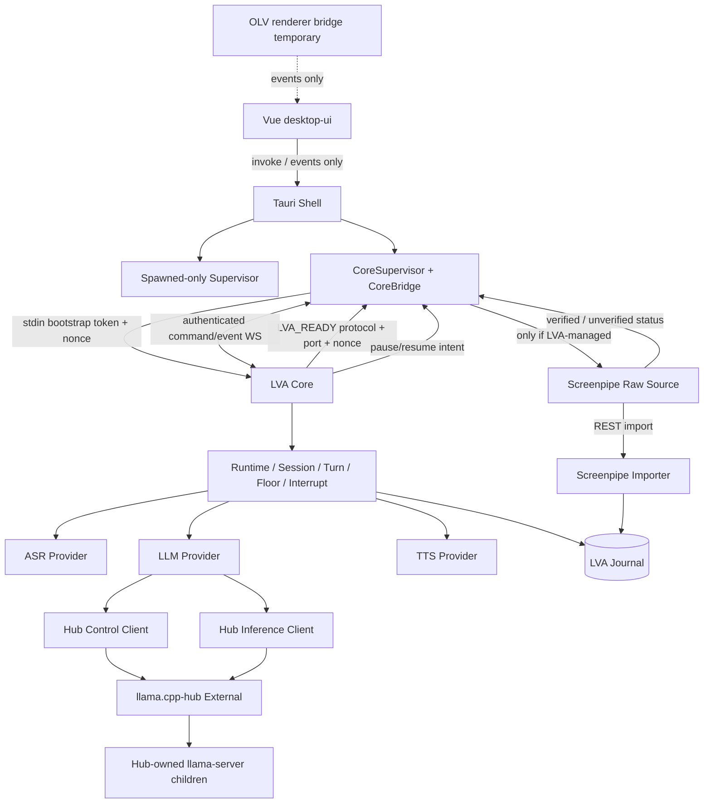
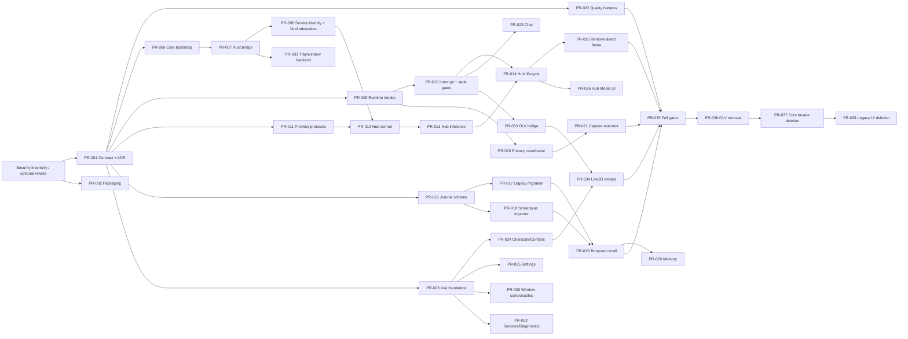

# LocalVoiceAgent — 架构收敛与复合优化实施计划 v1.2.1（Freeze Candidate）

> 日期：2026-09-21  
> 基线：本地 `main` = `cf1c96752ffb752de1581860968d5189cd6e2a2c`，与 `origin/main` 同步；工作树仅有未跟踪的 `docs/ARCHITECTURE-PLAN-2026-09.md`。  
> 文档定位：合并既有 v1.1、v1.2 与施工前一致性评审，替代它们作为后续施工蓝图。它不是实施提交，也不授权立即执行历史重写或删除。  
> 证据标记：`VERIFIED` 为已从当前仓库或上游源码/文档核实；`DECISION` 为本计划作出的目标决策；`TO VERIFY` 必须在对应 Gate 前用测试或固定版本制品确认。

## 执行摘要

本轮不推翻原计划的主方向，而是修正会导致误实现、误删数据或并行冲突的部分。终态保持以下十条硬约束：

1. **LVA Core 是唯一 Conversation Authority**：Session、Turn、Floor、Interrupt、ASR/LLM/TTS 调度、记忆路由只存在一份。
2. **llama.cpp-hub 是模型 Runtime Authority**：LVA 不扫描 GGUF、不启动或杀死 Hub 子进程、不维护 llama.cpp 版本和启动参数。
3. **Tauri 是桌面与 LVA-owned process Authority**：只允许停止由当前 Tauri 实例持有 child handle 的 `Spawned` 进程。
4. **WebView 不接触 Core/Hub 凭证和端点**：Vue 只通过 Tauri invoke/events；Rust bridge 持有 Core runtime token。
5. **Core 启动协议使用临时端口和一次性管道握手**：token 不进 CLI、环境变量、磁盘、日志或 WebView。
6. **LVA Journal 是 canonical application memory**；Screenpipe 只提供 raw reality source。
7. **Privacy Pause 的承诺必须可证明**：无法确认外部 Screenpipe 已停录时，显示 `UNVERIFIED`，不能宣称所有采集已关闭。
8. **Hub 没有自动卸载语义**：自动加载与手动停止是两回事；“Sleep AI”必须显式请求 Hub stop。
9. **迁移遵循 introduce → migrate → verify → deprecate → delete**；每次合并后 `main` 仍可启动。
10. **前端保持 Tauri 2.11**：先做 Windows/WebView2 spike；透明/穿透失败时降级窗口行为，不在 v1 临时改投 Electron。

### v1.2 对 v1.1 的关键修正

| 主题 | v1.1 问题 | v1.2 决策 |
|---|---|---|
| Hub 卸载 | 把 auto-load policy 误当成 auto-unload | Hub 自动加载可用；卸载只能显式 `POST /api/models/stop`；无 `set_auto_unload` |
| Hub load | 简化成 `{modelId}` 即完成 | 从 Hub 保存的 profile 构造版本化 load DTO；HTTP 只代表受理，须等 WS/轮询并验证 `/v1/models` |
| Hub 当前模型 | 默认 Hub 是单模型全局状态 | `current model` 是 LVA binding；Hub 可有多个 loaded models，禁止误停不相关模型 |
| IPC | token 生成、交付、端口发现不完整 | Tauri 生成 256-bit token + nonce，经 inherited stdin/anonymous pipe 交付；Core 绑定 `127.0.0.1:0` 并回 `LVA_READY` |
| Contract | 自由字符串 `kind` + 任意 `dict` | Pydantic discriminated union、版本化 envelope、state version、command idempotency、稳定错误码 |
| Cancellation | 被当成可传输契约 | 仅为 Core 内部 runtime primitive；不进入 JSON Schema |
| 隐私 | “Core 唯一麦克风消费者”与 Screenpipe 并行录音冲突 | Core 只独占实时会话音频；Privacy Pause 同时协调 LVA-managed Screenpipe，外部实例不可控则 `UNVERIFIED` |
| Journal | 去重、时区、纠正和 checkpoint 不够强 | 数据库唯一约束、UTC+时区、append-only revision、checkpoint、事务化 FTS、审计式硬删除 |
| 时间解析 | 失败后限制“最近 N 小时”会漏召回 | 解析失败不加时间限制，只做 FTS/文本召回并记录降级 |
| Git 历史 | 按未经证实的目录列表直接 filter | 先做 secrets/object/ref inventory；只清理实证路径；fresh mirror 执行；验证所有目标 refs |
| Reference | voice2/Akane 被误报不可考 | `AIIT-GLITCH/voice2` 已确认；Akane 仓库已确认，但确定性时间解析细节仍未验证 |
| PR/DAG | provider、Hub、Rust bridge、tray、OLV 删除存在 owner/依赖冲突 | 38 个单一 owner PR；Control client 依赖 provider protocol；删除由实际代码 owner 完成 |

### v1.2.1 — Contract Consistency Patch

本补丁不改变 v1.2 的主架构，只修复施工前的 8 个一致性问题：

| # | 修订 | 冻结后的规则 |
|---|---|---|
| 1 | G0/Wave 矛盾 | Wave 0 拆成 0a/0b；PR-022 在 G0 前完成 |
| 2 | Command CAS 粒度 | 不再使用全局 `expected_state_version`；只对冲突敏感 command 使用 aggregate/object revision |
| 3 | Hub bind 安全 | endpoint 为 loopback 只是必要条件；必须证明 Hub 的 effective listeners 全部受限于 loopback |
| 4 | Standby 录音语义 | Core mic 与所有 LVA-managed reality capture 都 Off；外部录音仍单独显示 |
| 5 | Temporal mention identity | 用 `mention_index + span_start/span_end` 区分同一文本内重复表达式 |
| 6 | Mute 文案与行为 | 统一为 `Output Mute / 静音播放`；它不关闭麦克风或 reality capture |
| 7 | Authority invariants | 新增 I21：Hub control only from Core；I22：所有 conversation entry 经 dispatcher/TurnController |
| 8 | Acoustic measurement | 软件 WASAPI loopback gate 与真实双通道 acoustic benchmark 分开定义 |

### Architecture freeze rule

v1.2.1 通过文档一致性检查后冻结。后续只允许：

- 用 S00、Hub compatibility spike、Tauri window spike 的真实结果补充 `VERIFIED/TO VERIFY` 状态；
- 通过既有 ADR convention 记录必要决策；
- 修复实施中发现的证据性错误或 contract bug。

在上述真实实验没有推翻核心前提时，不再进行第三轮整体架构重写。

---

# Part 0 — Repo Reality Check

## 0.1 当前仓库快照（VERIFIED）

| 领域 | 当前事实 | 结论 |
|---|---|---|
| Python Core | `src/lva/pipeline.py` 同时承担 Mode/Floor/turn/ASR/LLM/TTS/memory orchestration | 保留成熟音频行为，拆控制平面，不重写算法资产 |
| Core API | `src/lva/server.py` 提供 FastAPI/WS；当前无可靠鉴权/Origin 边界 | 改为 Tauri 启动的临时端口私有服务 |
| 旁路入口 | `/api/ask` 可绕过主 TurnController | 必须统一进入 command/turn pipeline |
| 第二核心 | `apps/open-llm-vtuber` 仍有 TurnContext、conversation handler、TTS scheduler、memory router、provider 初始化和 WS 控制 | P0：冻结扩展，迁移渲染后删除会话核心 |
| Desktop | `apps/desktop-shell` 为 Tauri 2.11；Rust 管理窗口、托盘、设置和进程 | 保持 Tauri；重构 supervisor/bridge |
| Process manager | `process_manager.rs` 存在按 PID/name/port 查找与 `taskkill`，并有 unload/switch/shutdown 逻辑 | 只保留 child-handle-based Spawned 管理；删除按名/端口杀进程 |
| LLM | `src/lva/llm.py` 是 OpenAI-compatible client；当前配置仍有 `127.0.0.1:1234`/LM Studio/裸 llama-server 假设 | 抽成协议；默认接 Hub 8080 推理面 |
| Hub | 当前仓库没有 llama.cpp-hub adapter | 新增独立 control 与 inference clients |
| Memory | `src/lva/memory.py` 为 SQLite/FTS 前身；OLV `memory_router.py` 直接接 Screenpipe | 建 Journal v2；两边逐个迁移 |
| Secrets | `settings.rs::get_settings()` 可把 secret 字段返回前端；根配置文件是 tracked user-specific runtime data | 建 public DTO 与 write-only secret API；runtime data 移到 LocalAppData |
| Tests | 有散落 benchmark/script 和 OLV tests，缺统一 root test architecture | 新建 unit/invariant/integration/fault/soak/migration/UX 分层 |
| Python | 本地 venv 为 Python 3.11.15；vendored OLV 要求 `>=3.10,<3.13`；根目录无 `pyproject.toml`/lock | 根项目定为 `>=3.11,<3.13`，使用项目本地 `.venv` + `uv.lock` |
| ADR | `docs/architecture-decisions.md` 已有 ADR-001..008 | 沿用单文件惯例，追加 ADR-009..012 并标记 supersedes |

## 0.2 当前运行拓扑

```text
Tauri desktop-shell
  ├─ legacy process manager ──> bare llama-server / LM Studio assumptions
  ├─ open-llm-vtuber process ─> second conversation core + Live2D
  ├─ Screenpipe process ──────> raw capture
  └─ legacy HTML UI

src/lva Core
  ├─ independent audio/turn pipeline
  ├─ independent HTTP/WS API
  └─ independent memory path
```

当前不是“单 Core + 多 adapter”，而是多个状态真相并存。第一阶段的核心任务是先冻结契约和 authority，再迁移消费者。

## 0.3 可复用资产

- `pipeline.py`：VAD、AEC、barge-in 候选/确认流程、bounded queues、现有 TurnMetrics。
- `asr.py`：sherpa-onnx/SenseVoice 等 CPU ASR 路径。
- `vocab.py`：中文专业术语纠正，是产品资产，不因架构重构替换。
- `tts.py`：现有 sherpa-onnx/MeloTTS 流式路径。
- `memory.py`：CJK segment + SQLite FTS5 的已验证思路。
- Tauri `crypto.rs`、`paths.rs`、hotkey/autostart/window 管理。
- OLV 的 Live2D runtime/assets 与已实现的 UI feedback，不保留其 Conversation Core。

## 0.4 Git 与安全事实

已核实：

- 当前 tracked 的 `settings.json`、`services.json`、`user_profile.json` 包含用户特定状态；其中有 DPAPI ciphertext 和绝对路径，不能继续作为仓库配置。
- 目前对相关配置执行的 `git log -S'sk-'` 没有证明存在明文 `sk-` key；**不能在无证据时宣称凭证已泄露**。
- 对所有历史对象的盘点只确认过 `apps/desktop-shell/src-tauri/WebView2Loader.dll` 等历史对象；没有证据支持 v1.1 所列 `venv/`、`recordings/`、`screenpipe-data/`、`data/`、`tools/w64devkit/` 和根 exe 都进入过历史。
- 因此 Security Maintenance Window 必须从测量开始；只有发现真实 secret 时才先轮换对应凭证。

## 0.5 Legacy 分类

| 项 | 分类 | 终态 |
|---|---|---|
| LM Studio 名称、1234 默认端口、LM Studio 路径 | DELETE | 文档历史可保留但加 `SUPERSEDED` |
| `src/lva/llm.py` 的 OpenAI-compatible streaming 能力 | MIGRATE | 成为通用 inference adapter 基础 |
| 裸 llama-server spawn/kill/scan/switch | DELETE | Hub control client 替代 |
| 按名/端口 `taskkill` | DELETE | 只通过当前实例 child handle 停 Spawned |
| OLV Conversation/Memory core | DELETE | LVA Core/Journal 接管 |
| OLV Live2D runtime/assets | MIGRATE | 嵌入 `desktop-ui` 后删 OLV Python 进程 |
| 旧 HTML UI | DEPRECATE → DELETE | 新 Vue 功能完整并通过 12h soak 后删除 |
| OpenAI-compatible remote provider | KEEP AS INFERENCE FALLBACK | 不得获得模型进程管理权 |

---

# Part 1 — Reference Project Matrix

下表只采用与 LVA 当前阶段直接相关的模式；上游版本与许可在实施 PR 中重新锁定，不以 stars 或宣传语作为设计依据。

| Project | Area | 采用 | 不采用 | 相关代码/文档 | 风险 |
|---|---|---|---|---|---|
| [AIRI](https://github.com/moeru-ai/airi) | Desktop companion IA | Character/Controls Island/Chat/Settings 分层、多窗口语境、普通/开发者 UI 分离 | 整体框架迁移、gaming/vision scope、因上游选择而改投 Electron | desktop/stage/window/settings modules | Tauri 行为必须本机 spike |
| [Open-LLM-VTuber](https://github.com/Open-LLM-VTuber/Open-LLM-VTuber) | Voice + Live2D | renderer 资产、消息分组、heard-response 思路 | 第二套 Turn/interrupt/memory/provider core | vendored fork `conversations/`、Live2D frontend | 上游 v2 方向不稳定；只作迁移源 |
| [OLV-Web](https://github.com/Open-LLM-VTuber/Open-LLM-VTuber-Web) | Live2D web renderer | 渲染边界和资源加载 | 整体前端架构 | frontend renderer | 与本地 fork 差异 |
| [GLaDOS](https://github.com/dnhkng/GLaDOS) | Voice control plane | pre-roll、队列时延、interruptible/shutdown 思路 | 全局线程/Event 隐式状态机 | speech listener/shutdown | AEC/自激需独立验证 |
| [Persona Engine](https://github.com/elevenyellow/handcrafted-persona-engine) | Windows overlay | 透明、置顶、交互和唇形同步体验 | C++ 实现栈 | desktop overlay | 只参考 UX |
| [LingChat](https://github.com/SlimeBoyOwO/LingChat) | 中文 companion UX | 角色组织、中文记忆呈现 | 剧情/复杂情绪系统 | character/memory UI | 许可与素材需隔离 |
| [Vocalis](https://github.com/Lex-au/Vocalis) | Realtime speech | playback cancel、TTS start/chunk/end、延迟拆分 | 大型 WS handler、base64 音频 | websocket/message types | 仅参考控制语义 |
| [MoeChat](https://github.com/AlfreScarlet/MoeChat) | 中文时间记忆 | 时间表达式→区间→时间索引粗筛思路 | 复制 GPL 实现、同步重模型 tagging | long memory utility | 仅重实现设计 |
| [ZcChat2](https://github.com/Zao-chen/ZcChat2) | 轻量桌宠 | 驻留资源和托盘简化基准 | Qt/C++ 栈 | desktop shell | 只作产品基准 |
| [voice2](https://github.com/AIIT-GLITCH/voice2) | Turn/Floor control | `FloorOwner`、`turn_id`、late result rejection、graceful degradation | 直接复制实现 | State/Floor/Interrupt controllers | **仓库已确认**；仍以本地行为测试为准 |
| [llama.cpp-hub](https://github.com/IIIIIllllIIIIIlllll/llama.cpp-hub) | Model runtime authority | inventory、profiles、load/stop、child ownership、OpenAI proxy、WS status | 把 Hub 当 LVA child；假设自动卸载；直连 WebView | [API](https://github.com/IIIIIllllIIIIIlllll/llama.cpp-hub/blob/master/docs/API.md)、[NOTES](https://github.com/IIIIIllllIIIIIlllll/llama.cpp-hub/blob/master/NOTES.md)、[model loading](https://github.com/IIIIIllllIIIIIlllll/llama.cpp-hub/blob/master/docs/model-loading-zh.md) | 上游维护意愿低；必须 pin + contract test |
| [llama.cpp](https://github.com/ggml-org/llama.cpp) | Inference engine | 理解 streaming、slots、cancel 限制 | 绕过 Hub 管进程/参数 | [server README](https://github.com/ggml-org/llama.cpp/blob/master/tools/server/README.md) | API 快速变化 |
| [Screenpipe](https://github.com/screenpipe/screenpipe) | Raw reality source | local SQLite/FTS、REST search、timeline、capture semantics | 把内部 DB 当 LVA schema；复制受限代码 | REST/search、audio/db crates | schema 和许可变化；REST 优先 |
| [RealtimeSTT](https://github.com/KoljaB/RealtimeSTT) | ASR pipeline | pre-roll、realtime/final 双 lane | 原线程模型 | audio recorder | 仅参考 |
| [RealtimeTTS](https://github.com/KoljaB/RealtimeTTS) | TTS pipeline | pull/feed、first-fragment fast path、stop 语义 | 原线程/generator 模型 | text-to-stream | engine 许可混杂 |
| [sherpa-onnx](https://github.com/k2-fsa/sherpa-onnx) | Local speech runtime | Windows/CPU ASR/TTS、当前已用模型路线 | 架构重写时顺便换引擎 | LVA 当前 ASR/TTS | 不同模型 hotword 能力不同 |
| [unspeech](https://github.com/moeru-ai/unspeech) | Speech provider registry | `provider/model` 注册与能力发现 | 复制 AGPL 代码 | provider registry | 只参考边界 |
| [xsAI](https://github.com/moeru-ai/xsai) | Provider API style | 能力与 generate/stream 正交、薄 adapter | 无状态万能抽象 | packages | 0.x 变更风险 |
| [AkaneCompanionLab](https://github.com/misaka-coder/AkaneCompanionLab) | Time-aware memory | 分层、time-aware memory 的方向 | 在未读到确定 parser 前把它当实现依据 | README/memory modules | **仓库已确认，精确 relative-time parser 仍 TO VERIFY** |

采用图：

```text
Desktop IA     = AIRI + Persona Engine + ZcChat2
Voice control  = 本地 pipeline + voice2 concepts + GLaDOS/Vocalis patterns
Speech runtime = sherpa-onnx current path + RealtimeSTT/TTS cancellation ideas
Provider layer = thin protocols + registry; Hub adapter and OpenAI-compatible fallback
Model runtime  = llama.cpp-hub only
Memory         = LVA Journal + Screenpipe REST importer + deterministic temporal routing
Renderer       = OLV assets temporarily; final direct desktop-ui integration
```

---

# Part 2 — Architecture Decision

## 2.1 Target architecture（ASCII）

```text
┌──────────────────────── Windows 11 Desktop ─────────────────────────┐
│                                                                    │
│  ┌──────────── desktop-ui: Vue 3 / TS / Pinia ──────────────────┐  │
│  │ Character | Controls | Chat | Memory | Settings | Diagnostics│  │
│  └──────────────────────┬────────────────────────────────────────┘  │
│                         │ Tauri invoke/events only                  │
│  ┌──────────────────────▼────────────────────────────────────────┐  │
│  │ Tauri Desktop Shell (Rust)                                   │  │
│  │ windows/tray/hotkeys/autostart/geometry                      │  │
│  │ Spawned-only supervisor                                      │  │
│  │ CoreSupervisor + one authenticated CoreBridge WS             │  │
│  │ ManagedCaptureExecutor                                       │  │
│  └──────────────────────┬────────────────────────────────────────┘  │
│                         │ child stdin bootstrap: token+nonce         │
│                         │ Core READY: protocol+ephemeral port+nonce  │
│                         │ authenticated WS, bidirectional            │
│  ┌──────────────────────▼────────────────────────────────────────┐  │
│  │ LVA Core (Python, 127.0.0.1:ephemeral)                       │  │
│  │ RuntimeState / Session / Turn / Floor / Interrupt            │  │
│  │ CaptureCoordinator / ProviderRegistry / EventBus             │  │
│  │ ASR ───────┐  LLM ───────────┐  TTS ───────┐                │  │
│  │ Journal ◄──┴──────────────────┴──────────────┘                │  │
│  └───────────────────────────────┬───────────────────────────────┘  │
└──────────────────────────────────┼───────────────────────────────────┘
                                   │ Core-only Hub access
                 ┌─────────────────▼────────────────────┐
                 │ llama.cpp-hub (External/Adopted)    │
                 │ control /api/* + inference /v1/*    │
                 └─────────────────┬────────────────────┘
                                   │ Hub-owned child processes
                          llama-server @8081+

Screenpipe (Spawned/Adopted/External)
  ├─ capture status/control acknowledgement ──> Tauri ──> Core
  └─ REST search/events ──> ScreenpipeImporter ──> LVA Journal
```

## 2.2 Mermaid



## 2.3 Core bootstrap protocol

1. Tauri 创建 32-byte cryptographically random token、128-bit nonce 与 `protocol_version=1`。
2. Tauri 以 `Spawned` child 启动 `python -m lva`，stdin/stdout 使用 pipe；不得把 token 放入命令行、环境变量或文件。
3. Tauri 向 child stdin 写一行长度受限 JSON 后立即关闭 bootstrap write side：

   ```json
   {"protocol_version":1,"token":"base64url-256-bit","nonce":"uuid","parent_pid":1234}
   ```

4. Core 校验 schema，绑定 `127.0.0.1:0`，stdout 仅输出一行机器可读 readiness：

   ```text
   LVA_READY {"protocol_version":1,"port":49152,"nonce":"uuid","runtime_instance_id":"uuid"}
   ```

5. Rust 用自己持有的 child handle、nonce 与 protocol version 验证 readiness；不信任仅由进程文本声明的 PID。
6. Rust 建立唯一 authenticated WS；Vue 只能通过 Tauri command/event 转发。
7. Core 重启必须轮换 token、nonce、端口与 `runtime_instance_id`；旧连接和旧 command 不得重放。
8. 超时、额外 readiness 行、nonce 不匹配、非 loopback 地址或协议不兼容均视为启动失败，并安全终止**该 child handle**。

---

# Part 3 — Authority Matrix

## 3.1 Authority

| 关注点 | 唯一 owner | 允许 | 禁止 |
|---|---|---|---|
| Windows windows/tray/hotkeys/autostart/geometry | Tauri Shell | 操作桌面能力 | Core 直接操作原生窗口 |
| LVA-owned process lifecycle | Tauri Supervisor | 停止当前实例持有 handle 的 Spawned child | 按名称/端口/PID 猜测并杀进程 |
| Product runtime state | LVA Core | 生成带 version 的 RuntimeState | UI 自行推导权威状态 |
| Session/Turn/Floor/Interrupt | LVA Core | 单一状态机与事务化中断 | OLV、UI 或 provider 自持一套 |
| Realtime conversation audio | LVA Core | VAD/ASR/floor input | Screenpipe 参与 Live floor 决策 |
| Managed capture execution | Tauri | 对 LVA-managed Screenpipe 执行 pause/resume | 宣称可控制 External 实例 |
| ASR/LLM/TTS scheduling | LVA Core | 通过 provider protocols | UI 直接调 provider |
| GGUF inventory/profile/llama.cpp versions/child lifecycle | llama.cpp-hub | LVA 经受支持 API 请求 | LVA scan/spawn/kill Hub child |
| LVA selected model binding | LVA Core | 记录 desired/active/provider_epoch | 把 Hub 所有 loaded models 当成 LVA 所有 |
| Canonical application memory | LVA Journal | revision/recall/import provenance | 直接把 Screenpipe schema 暴露给业务 |
| Raw reality capture | Screenpipe | 提供 raw events | 成为 Turn/Session authority |
| Renderer/Live2D | desktop-ui | 消费 state/event | 产生 Conversation 状态 |
| Secrets | Rust settings/OS protection layer | write-only 更新、public status DTO | 返回明文给 WebView |

## 3.2 Process ownership

```text
Spawned  = 当前 Tauri 实例持有 child handle；允许 graceful stop → bounded wait → kill that handle。
Adopted  = 识别到兼容外部实例；只观察和经公开 API 请求，不杀。
External = 用户管理；只观察，不改变生命周期。
Unknown  = 身份无法证明；永不杀。
```

Hub 在本项目中始终是 `Adopted` 或 `External`，绝不标为 `Spawned`。Hub-owned llama-server 不进入 LVA supervisor registry。

## 3.3 Product modes

| Mode | Core realtime mic | LVA-managed reality capture | VAD/ASR | Journal | LLM/TTS scheduling | Model unload | 退出/恢复 |
|---|---:|---:|---:|---:|---:|---:|---|
| Standby | Off | **Off** | Off | 可查询 | Forbidden | 不自动 | 可进 Passive/Live |
| Passive | On | **On**（进入该模式即为明确录制动作） | On | 写入 | **硬边界 Forbidden** | 不自动 | 可进 Live/Standby/Pause |
| Live | On | 按 `record_reality_during_live` 设置；首次安装默认 Off，需用户明确启用 | On | 写入会话 | Allowed | 不自动 | 可进 Standby/Pause |
| Privacy Pause | Off | **Off** | Off | 只读 | Forbidden | 不自动 | 恢复到内存中的 `resume_mode`；应用重启一律 Standby |

补充规则：

- `resume_mode` 不持久化，避免开机后自动恢复录音。
- Passive 在 provider 层也必须被拒绝调用 LLM/TTS，不只靠 UI 隐藏按钮。
- Standby 的产品语义固定为“AI 待机且 LVA-managed reality recording 已停止”；不得让 LVA 自己管理的 Screenpipe 在后台继续录制。
- 外部或 Unknown Screenpipe 不受 Standby 控制；检测到时 UI 必须另外显示 `External reality recording detected/unknown`，不能把 Standby 呈现成系统级隐私保证。
- `Output Mute / 静音播放` 只立即停止并抑制 speaker playback；它不关闭 Core mic、VAD/ASR、Journal 或 reality capture。停止采集只能用 Privacy Pause。
- “Sleep AI”是独立显式命令：仅对明确绑定且授权停止的 model 请求 Hub stop。
- Standby、Privacy Pause、Quit 不自动停止用户原本已加载的 Hub model。

## 3.4 Privacy scope

`RuntimeState.privacy_scope` 必须是以下之一：

- `VERIFIED_ALL_LVA_MANAGED_CAPTURE_OFF`
- `LVA_CORE_OFF_EXTERNAL_CAPTURE_PRESENT`
- `LVA_CORE_OFF_EXTERNAL_CAPTURE_UNKNOWN`
- `NOT_PAUSED`

UI 只有第一种可显示“所有由 LVA 管理的采集已暂停”；第二/三种必须显示具体未覆盖对象。

---

# Part 4 — Contract Freeze

## 4.1 单一 schema 来源

新建 `src/lva/contracts/`，使用 Pydantic v2 discriminated unions：

```text
contracts/
  ids.py        RuntimeInstanceId / SessionId / TurnId / CommandId / EventId
  enums.py      Mode / FloorOwner / Activity / ServiceState / ProviderState / Ownership
  state.py      RuntimeState / CaptureState / PlaybackState / HubBinding / HubBindAttestation
  events.py     EventEnvelope + typed event payload union
  commands.py   CommandEnvelope + typed command payload union + CommandResult
  errors.py     ErrorEnvelope + stable ErrorCode
  schema.py     JSON Schema generation
```

生成制品（只允许 codegen 覆盖，Rust/UI owner 不手改）：

```text
schemas/lva-ipc-v1.json
apps/desktop-ui/src/generated/lva-ipc.ts
apps/desktop-shell/src-tauri/src/generated/lva_ipc.rs
```

CI 重新生成并执行 zero-diff；Rust/TS 不手写第二份 enum。首版固定使用 Pydantic JSON Schema + pinned `typify`/`json-schema-to-typescript` codegen，升级生成器视为 contract 变更。

## 4.2 IDs 与版本

```python
class TurnId(BaseModel):
    session_id: UUID
    sequence: int  # per-session monotonic, >= 1

class RuntimeState(BaseModel):
    schema_version: Literal["1.0"]
    runtime_instance_id: UUID
    snapshot_version: int
    runtime_control_revision: int
    hub_binding_revision: int
    mode: Mode
    resume_mode: Mode | None
    session_id: UUID | None
    current_turn: TurnId | None
    floor: FloorOwner
    activity: ActivityState
    mic_capture: CaptureState
    managed_capture: CaptureAggregate
    playback: PlaybackState
    services: dict[str, ServiceStatus]
    providers: dict[str, ProviderStatus]
    hub_binding: HubBinding | None
    hub_bind_attestation: HubBindAttestation | None
    privacy_scope: PrivacyScope
```

- `snapshot_version` 用于判断完整 snapshot 的新旧；任何会改变发布 snapshot 的状态都可使其递增，但它**不作为所有用户命令的全局 CAS**。
- `runtime_control_revision` 只在 Mode、resume intent、Privacy/reality-capture control 发生可提交变更时递增；activity、heartbeat、provider progress 不改变它。
- `hub_binding_revision` 只在 desired/active binding、load origin 或已提交 rollback 发生变更时递增；busy/progress heartbeat 不改变它。
- Rust 的 public settings DTO 独立携带 `settings_revision`；Journal 每条 event 使用自己的 `current_revision`。这两个 revision 不塞进全局 RuntimeState CAS。
- event `sequence` 在同一 `runtime_instance_id` 内严格递增；重启后以新 instance id 从 1 开始。
- 时间均为 timezone-aware RFC 3339 UTC；业务 memory 另外保存事件原始时区。

## 4.3 Event envelope

```json
{
  "schema_version": "1.0",
  "event_id": "uuid",
  "sequence": 184,
  "runtime_instance_id": "uuid",
  "occurred_at": "2026-09-21T08:01:02.123Z",
  "source": "core.turn_controller",
  "session_id": "uuid-or-null",
  "turn_id": {"session_id":"uuid","sequence":7},
  "type": "turn.cancelled",
  "payload": {"reason":"barge_in","provider_epoch":4}
}
```

`payload` 不允许任意 `dict`；按 `type` 使用 discriminated union。首版事件集：

```text
runtime.snapshot / mode.changed / privacy.scope_changed
session.started / session.ended
turn.started / turn.cancel_requested / turn.cancelled / turn.completed
interrupt.detected / interrupt.committed / interrupt.settled
audio.vad_started / audio.vad_ended / audio.utterance_ready
audio.playback_started / audio.playback_stop_requested / audio.playback_silenced
provider.state_changed / hub.binding_changed / hub.operation_progress
memory.committed / memory.revision_added / memory.recall_completed
service.state_changed / error.raised
```

所有可能造成 UI、播放、历史或 memory mutation 的事件必须含 `turn_id` 和 `provider_epoch`；纯系统事件可为空。

## 4.4 Command envelope 与并发控制

```json
{
  "schema_version":"1.0",
  "command_id":"uuid",
  "idempotency_key":"client-stable-key",
  "precondition":{"aggregate":"runtime_control","revision":7},
  "issued_at":"2026-09-21T08:01:02.123Z",
  "type":"runtime.set_mode",
  "payload":{"mode":"privacy_pause"}
}
```

`precondition` 是可选的 typed union：

```text
runtime_control + revision
hub_binding    + revision
settings       + revision
memory_event   + resource_id(event_id) + revision
```

只有会覆盖同一业务 aggregate 的冲突敏感命令才要求 revision；服务 heartbeat、provider progress 或 playback activity 不应让一次有效点击变成 stale。

| Command | Revision precondition |
|---|---|
| `runtime.set_mode` / `runtime.restore_mode` | required: `runtime_control_revision` |
| `hub.bind_model` / `hub.sleep_bound_model` | required: `hub_binding_revision` |
| settings update/clear secret | required: `settings_revision` |
| `memory.correct` / `memory.hard_delete` | required: 目标 event 的 `current_revision` |
| `turn.send_text` / `turn.cancel` | 无 snapshot CAS；执行时校验当前 Session/Turn/Mode |
| `memory.search` / `diagnostics.export_redacted` / refresh/retry | 不需要 CAS；仍必须 idempotent 或明确为 read-only |

命令结果：`accepted | applied | rejected | duplicate`，回传 `command_id`、最新 `snapshot_version`、发生变化的 aggregate revision 和可选 typed error。Core 保存有界 idempotency window；重复命令返回首次结果，不重复执行外部副作用。precondition 不匹配返回 `STALE_REVISION`，并返回该 aggregate 当前 revision；客户端只刷新相关 aggregate 或 snapshot 后重试。

首版命令：

```text
runtime.get_snapshot / runtime.set_mode / runtime.restore_mode
turn.send_text / turn.cancel
hub.refresh / hub.bind_model / hub.sleep_bound_model
settings.update_public / settings.set_secret / settings.clear_secret
memory.search / memory.correct / memory.hard_delete
service.retry / diagnostics.export_redacted
```

## 4.5 Error model

```python
class ErrorEnvelope(BaseModel):
    code: ErrorCode
    message: str                 # user-safe
    retryable: bool
    severity: Literal["info", "warning", "error", "fatal"]
    component: str
    correlation_id: UUID
    redacted_details: dict[str, JsonValue] | None
```

稳定错误码至少包括：

```text
AUTH_REQUIRED / AUTH_FAILED / ORIGIN_REJECTED / PROTOCOL_MISMATCH
STALE_REVISION / DUPLICATE_COMMAND / INVALID_TRANSITION
PASSIVE_PROVIDER_FORBIDDEN / PRIVACY_UNVERIFIED
HUB_UNAVAILABLE / HUB_VERSION_UNSUPPORTED / HUB_CONTROL_UNSAFE / HUB_BIND_UNVERIFIED
PROFILE_REQUIRED / MODEL_CONFLICT_REQUIRES_CONFIRMATION / MODEL_LOAD_FAILED
PROVIDER_DISCONNECTED / TURN_CANCELLED / STALE_EFFECT_DROPPED
JOURNAL_BUSY / IMPORT_SCHEMA_UNSUPPORTED / MIGRATION_FAILED
```

错误 details 不得含 token、API key、完整用户文本、绝对个人路径或原始音频。

## 4.6 Cancellation 与 stale-effect gates

`CancellationToken`、`asyncio.Task.cancel()`、SSE close、TTS/player flush 是 Core 内部 primitive，不进 wire schema。

三层 gate：

1. 调度前：`turn_id == current_turn && provider_epoch == current_epoch`。
2. stream 中：每个 chunk 前检查 cancellation/current identity。
3. 所有 side effect 前：播放、UI output、avatar animation、history、Journal commit 再检查一次。

旧任务无法及时停止时允许继续消耗少量计算，但任何 late result 必须在 Gate 3 丢弃并产生可计数的 `STALE_EFFECT_DROPPED`，不得污染状态。

---

# Part 5 — llama.cpp-hub Integration

## 5.1 已核实的 Hub 边界

- 当前上游为 Java 21 + Netty；Hub 启动并拥有 llama-server child。
- 默认入口为 8080，child 通常分配 8081+；LVA 不依赖 child 端口。
- 管理面至少使用：

  ```text
  GET  /api/sys/version
  GET  /api/node/info
  GET  /api/models/list
  GET  /api/models/loaded
  GET  /api/models/refresh
  GET  /api/models/config/get?modelId=...
  POST /api/models/load
  POST /api/models/stop
  WS   /ws
  GET  /v1/models
  POST /v1/chat/completions
  ```

- load HTTP 响应不是 readiness 证明；成功必须由 WS/轮询与推理面二次验证。
- Hub 支持 auto-load，但其 [NOTES](https://github.com/IIIIIllllIIIIIlllll/llama.cpp-hub/blob/master/NOTES.md) 明确不是 auto-unload；模型停止是手动控制操作。
- Hub 可同时加载多个模型/节点。“当前模型”是 LVA 自己的 binding，不是 Hub 全局 singleton。
- Hub 的 API key 主要保护 `/v1*`；不能假设 `/api/*` 管理面已被同一机制保护。受支持基线要求 loopback 绑定。

## 5.2 Adapter 分层

```python
class LlamaCppHubControlClient(Protocol):
    async def identity() -> HubIdentity: ...
    async def capabilities() -> HubCapabilities: ...
    async def list_models() -> list[HubModel]: ...
    async def list_loaded() -> list[LoadedHubModel]: ...
    async def get_profile(model_id: str) -> HubLaunchProfile: ...
    async def load(request: HubLoadRequest) -> HubOperation: ...
    async def stop(model_id: str) -> HubOperation: ...
    async def watch(self) -> AsyncIterator[HubEvent]: ...

class LlamaCppHubInferenceClient(LLMProvider):
    async def models() -> list[str]: ...
    async def stream_chat(self, request, turn, cancellation): ...
```

拆分原因：管理面和推理面的鉴权、失败语义、兼容性与重试边界不同。

## 5.3 Versioned compatibility contract

首个兼容目标冻结到已审阅的上游 commit `a9cf12809e8243ff0b820abda1a24934d4eb7026` 及实际 `/api/sys/version` fixture。实施时保存脱敏请求/响应 fixture，不把 master 文档当长期契约。

握手：

```text
/api/sys/version + /api/node/info + effective-bind verification
  ├─ supported fixture + probes + VERIFIED_LOOPBACK -> READY
  ├─ unknown version, probes partially pass         -> DEGRADED; disable missing operations
  ├─ wildcard/non-loopback listener confirmed       -> HUB_CONTROL_UNSAFE; management disabled
  ├─ effective listeners cannot be proven           -> HUB_BIND_UNVERIFIED; management disabled
  └─ unreachable                                    -> UNAVAILABLE; Passive/Journal/UI continue
```

Control client 必须有 versioned DTO；未知字段只读保留，不盲目回写。

## 5.4 Load profile 与 `PROFILE_REQUIRED`

不得实现为固定 `POST {modelId}`。流程：

1. 从 `/api/models/list` 得到模型 identity。
2. 从 `/api/models/config/get?modelId=...` 读取 Hub 保存的 profile。
3. 映射为 `HubLoadRequestV0_9_8_3`；保留该版本要求的 `cmd/extraParams`、`llamaBinPathSelect`、vision/device/mg/node 等适用字段。
4. profile 缺少 Hub 要求字段时返回 `PROFILE_REQUIRED`，UI 引导用户在 Hub 配置；LVA 不私自猜 `-ngl/-c/mmproj`。
5. POST load 后进入 `LOADING`；订阅 WS，同时以有界退避轮询 loaded 状态。
6. 只有 target 出现在 loaded 且 `/v1/models` 可见/最小 probe 成功，才提交 `active_model_id`。

## 5.5 Model binding 与 switch saga

```text
HubBinding:
  desired_model_id
  active_model_id
  provider_epoch
  load_origin = loaded_by_lva | preexisting | unknown
  status = unbound | preparing | stopping | loading | verifying | ready | degraded | failed
```

显式 Change Model：

```text
PREPARE
  reject new Live turns
  cancel current turn and increment provider_epoch
  flush TTS/playback
  ↓
RESOLVE CONFLICT
  unrelated loaded models: never stop
  old loaded_by_lva: may stop as part of explicit switch
  old preexisting/unknown: require user confirmation before stop
  ↓
STOP OLD IF AUTHORIZED
  POST /api/models/stop
  wait confirmed stopped
  ↓
LOAD TARGET
  use saved Hub profile
  wait async operation
  ↓
VERIFY
  loaded status + /v1/models + inference probe
  ↓
COMMIT BINDING
  publish new provider_epoch and accept turns
```

任一步失败：binding 进入 `FAILED/DEGRADED`，旧 turn 不可复活；若旧 model 仍健康，可通过显式 rollback operation 重新 bind，不能靠恢复旧内存状态假装成功。

## 5.6 Sleep, Standby, Quit

| Action | Hub 行为 |
|---|---|
| Enter Standby | 不 stop model |
| Enter Privacy Pause | 不 stop model；只停止采集和对话调度 |
| Quit LVA | 不停止 Hub，不停止 preexisting model，不杀 child |
| Sleep AI | 对 `loaded_by_lva` 的 bound model 显式 stop；preexisting/unknown 需确认 |
| Change Model | 执行 5.5 saga，只影响明确选择的旧 binding |

## 5.7 Disconnect/restart/fallback

- WS 断开：Provider `DISCONNECTED`，停止创建新 LLM turn；现有输出经 stale gate 截断。
- 退避：1s、2s、4s、8s、16s、30s 上限，带 jitter；同一时刻只有一个 reconnect task。
- Hub restart 后重新 identity/capability/inventory，不能复用旧 loaded/pid/port 记录。
- Passive、Journal、Memory search、Character、Settings 继续工作。
- `OpenAICompatibleProvider` 只提供推理 fallback；**绝不恢复裸 llama-server spawn/kill/scan**。

## 5.8 Hub 安全

- 配置 URL 为 `127.0.0.1`/`::1` 只是必要条件，不证明 Hub 没有同时监听 `0.0.0.0`、`::` 或其他网卡。
- Windows baseline 必须验证 **effective bind**：
  1. 解析 control URL，所有解析结果必须是 loopback；remote Hub 不属于 v1 支持范围。
  2. 若 pinned Hub 的 `/api/node/info` 或本地配置可报告 bind host，读取并交叉验证；不得假设字段存在。
  3. Tauri 以只读方式查询 Windows TCP listener table，把 control port 映射到已识别 Hub 进程，并检查 IPv4/IPv6 所有 listener；`0.0.0.0`、`::` 或任何非 loopback 地址均判定 unsafe。按端口/PID查询在这里仅用于观测，绝不能复用为 kill authority。
  4. 无法可靠映射 process/listener 时状态为 `UNVERIFIED_BIND`，管理操作默认禁用；不能因为 LVA 连接使用 loopback URL 就放行。
  5. Hub 每次重启、identity 变化或 reconnect 后重新验证。
- 状态只有 `VERIFIED_LOOPBACK | VERIFIED_NON_LOOPBACK | UNVERIFIED_BIND`；只有第一种允许 load/stop/switch control。
- LVA 不把 Hub endpoint/API key 送进 WebView。
- “Open Hub”只在用户明确点击后由系统浏览器打开；不嵌入 LVA WebView。
- 日志对 query、headers、profile 中可能的路径/凭证做 redaction。

---

# Part 6 — Backend Migration

## Phase -1 — Security Maintenance Window（串行，无 worktree）

这是条件性维护事件，不是普通 PR。只有 inventory 证明需要重写历史时才执行 filter-repo。

1. 冻结 push，列出所有 branch/tag/remote/ref 和已有 worktree。
2. 在 fresh mirror/bare clone 中运行：
   - secret scanners（至少 gitleaks + trufflehog，保留版本和输出）；
   - `git rev-list --objects --all` + object size/path inventory；
   - 对候选 secret/path 做历史搜索。
3. 生成“确认删除清单”和“保留清单”；不得使用未经展开验证的通配符。
4. 若确认有效凭证，**先轮换/吊销**，再重写历史。
5. 在仓库之外创建 `git bundle --all` 与 checksum；验证可恢复。
6. 用精确 path/replace-text spec 在 mirror 执行 `git filter-repo`。
7. 推送所有明确纳入范围的 branches/tags；不只改 `main`。
8. fresh clone 验证：secret scan、对象枚举、构建、关键测试、所有目标 refs。
9. 记录新 baseline SHA，更新本文与开放 PR；所有协作者重新 clone。

若扫描只发现当前 tracked runtime config 而无历史 secret，可只做普通删除/忽略 PR，不做破坏性历史重写。

## Phase 0 — Packaging / configuration / ADR

- 根 `pyproject.toml` 只打包 `src/lva`，Python `>=3.11,<3.13`；提交 `uv.lock`。
- 只创建项目本地 `.venv`；安装/测试不得修改全局 Python、CUDA、Node、WSL。
- runtime data 统一到 `%LOCALAPPDATA%\LocalVoiceAgent\`：

  ```text
  config/settings.json
  config/services.json
  data/journal.sqlite3
  logs/
  backups/
  runtime/       # 仅短生命周期状态；不得保存 token
  ```

- repo 仅保留 `settings.example.json`、`services.example.json`，无真实用户名、盘符、密文或 API key。
- 在现有 `docs/architecture-decisions.md` 追加：
  - ADR-009 Hub Runtime Authority（supersedes ADR-007 的 LM Studio 部分）
  - ADR-010 Single Conversation Authority and Secure IPC（supersedes ADR-001 的 OLV authority）
  - ADR-011 LVA Journal Canonical Memory（supersedes ADR-006 的直接 Screenpipe DB ownership）
  - ADR-012 Privacy Pause Capture Scope
- 不删除旧 ADR；更新其 status/superseded-by，保留决策历史。

## Phase 1 — Secure Core boundary

- 实现 Part 2 bootstrap/auth。
- Core private API 默认只监听 ephemeral loopback。
- bearer token 用 constant-time compare；所有 private HTTP/WS 入口统一 middleware。
- 有 `Origin` 时只允许 native bridge 的固定值；无 Origin 的 native client 仍必须有 token。Origin 是附加检查，不是认证替代品。
- `/api/ask`、legacy WS 与测试入口全部进入同一 command dispatcher；禁止旁路 TurnController。

## Phase 2 — Supervisor convergence

- `ProcessRecord` 必须持有 `ownership`、child handle、start nonce、expected executable identity。
- graceful stop 有时间界限；超时只 kill 已持有的 child handle。
- 删除 `find_pid_by_name`、`find_pid_by_port`、对 1234/12393 的 taskkill 和 shutdown-all 猜测逻辑。
- Hub/Hub children 永远不注册成 Spawned。

## Phase 3 — Core convergence

- 把 `pipeline.py` 中状态逐步移到 `core/runtime.py`、`session.py`、`turn.py`、`floor.py`、`interrupt.py`。
- 保留现有音频线程、VAD/AEC/ASR/TTS 行为，先以 adapter 接入新 state machine。
- transaction interrupt：

  ```text
  detect → confirm → cancel current Turn → increment sequence/epoch
  → close LLM stream → cancel TTS → purge queue → stop playback
  → Floor=USER → INTERRUPT_COMMITTED → settle
  ```

- Mode transition 由 Core 唯一执行；UI、tray 都只发 command。

## Phase 4 — Provider/Hub

- provider protocols 先落地，Hub control → inference → lifecycle 顺序合并。
- 首轮不替换 ASR/TTS engine，只把现有实现包成 provider。
- Hub 达到 G3 后才删除 direct llama lifecycle。

## Phase 5 — Journal/Privacy

- Journal schema → legacy migration → Screenpipe importer → temporal recall。
- Privacy coordinator 与 Tauri capture executor 分两个 owner PR；只有 acknowledgement 到达才更新 `privacy_scope`。

## Phase 6 — Frontend/Renderer

- Vue foundation 与 Tauri spike 先行；旧 HTML 并存。
- OLV 先冻结成只读 renderer bridge；新 desktop-ui 功能完整后再嵌入 runtime/assets。

## Phase 7 — Convergence and deletion

- fault suite → 2h → 8h → 12h soak。
- 只有 deletion gates 全绿才删 OLV core、Core facade 和 legacy UI。
- 每次删除单独 PR，可由 release tag 恢复，不与新功能混合。

---

# Part 7 — Memory Migration

## 7.1 Journal v2 schema

数据库固定为 `%LOCALAPPDATA%\LocalVoiceAgent\data\journal.sqlite3`。核心 schema：

```sql
PRAGMA journal_mode=WAL;
PRAGMA foreign_keys=ON;

CREATE TABLE sessions (
  session_id TEXT PRIMARY KEY,
  started_at_utc_us INTEGER NOT NULL,
  ended_at_utc_us INTEGER,
  source TEXT NOT NULL
);

CREATE TABLE turns (
  session_id TEXT NOT NULL,
  turn_sequence INTEGER NOT NULL CHECK(turn_sequence >= 1),
  started_at_utc_us INTEGER NOT NULL,
  ended_at_utc_us INTEGER,
  status TEXT NOT NULL,
  PRIMARY KEY(session_id, turn_sequence),
  FOREIGN KEY(session_id) REFERENCES sessions(session_id)
);

CREATE TABLE events (
  event_id TEXT PRIMARY KEY,
  session_id TEXT,
  turn_sequence INTEGER,
  external_source TEXT,
  external_id TEXT,
  occurred_at_utc_us INTEGER NOT NULL,
  event_timezone TEXT NOT NULL DEFAULT 'UTC',
  utc_offset_minutes INTEGER NOT NULL DEFAULT 0,
  started_at_utc_us INTEGER,
  ended_at_utc_us INTEGER,
  speaker TEXT,
  source TEXT NOT NULL,
  raw_text TEXT NOT NULL,
  current_revision INTEGER NOT NULL DEFAULT 0,
  audio_ref TEXT,
  asr_provider TEXT,
  asr_model TEXT,
  confidence REAL CHECK(confidence IS NULL OR (confidence >= 0 AND confidence <= 1)),
  domain TEXT,
  provenance_json TEXT NOT NULL DEFAULT '{}',
  created_at_utc_us INTEGER NOT NULL,
  FOREIGN KEY(session_id, turn_sequence) REFERENCES turns(session_id, turn_sequence)
);

CREATE UNIQUE INDEX ux_events_external
  ON events(external_source, external_id)
  WHERE external_source IS NOT NULL AND external_id IS NOT NULL;

CREATE TABLE event_revisions (
  event_id TEXT NOT NULL,
  revision INTEGER NOT NULL CHECK(revision >= 1),
  corrected_text TEXT NOT NULL,
  rules_version TEXT,
  reason TEXT NOT NULL,
  actor TEXT NOT NULL,
  created_at_utc_us INTEGER NOT NULL,
  PRIMARY KEY(event_id, revision),
  FOREIGN KEY(event_id) REFERENCES events(event_id) ON DELETE CASCADE
);

CREATE TABLE temporal_mentions (
  event_id TEXT NOT NULL,
  revision INTEGER NOT NULL,
  mention_index INTEGER NOT NULL CHECK(mention_index >= 0),
  span_start INTEGER NOT NULL CHECK(span_start >= 0),
  span_end INTEGER NOT NULL CHECK(span_end > span_start),
  expression TEXT NOT NULL,
  anchor_utc_us INTEGER NOT NULL,
  range_start_utc_us INTEGER,
  range_end_utc_us INTEGER,
  parser_version TEXT NOT NULL,
  parse_status TEXT NOT NULL,
  PRIMARY KEY(event_id, revision, mention_index),
  FOREIGN KEY(event_id) REFERENCES events(event_id) ON DELETE CASCADE
);

CREATE TABLE import_checkpoints (
  importer TEXT NOT NULL,
  external_source TEXT NOT NULL,
  cursor TEXT,
  watermark_utc_us INTEGER,
  source_schema_version TEXT,
  updated_at_utc_us INTEGER NOT NULL,
  PRIMARY KEY(importer, external_source)
);

CREATE TABLE deletion_audit (
  operation_id TEXT PRIMARY KEY,
  requested_at_utc_us INTEGER NOT NULL,
  completed_at_utc_us INTEGER,
  reason_code TEXT NOT NULL,
  event_id_hashes_json TEXT NOT NULL,
  deleted_count INTEGER NOT NULL
);

CREATE VIRTUAL TABLE events_fts USING fts5(
  event_id UNINDEXED,
  corrected_seg,
  raw_seg,
  tokenize='unicode61'
);

CREATE VIEW current_event_text AS
SELECT e.*,
       COALESCE(r.corrected_text, e.raw_text) AS current_text
FROM events e
LEFT JOIN event_revisions r
  ON r.event_id=e.event_id AND r.revision=e.current_revision;
```

数据库约束：

- trigger 禁止 UPDATE `events.raw_text`。
- trigger 禁止 UPDATE 已有 `event_revisions`；正常路径只能 INSERT 新 revision。
- `JournalRepository` 是唯一写入口；新增 revision、更新 `current_revision`、重建该 event 的 FTS row 必须同一事务。
- 物理 DELETE 只能经 `PrivacyDeletionService`，先记录不含原文的 audit，再在事务中级联删除；普通 repository 无 delete 方法。
- `confidence` 未提供时为 `NULL`，不得伪造 0。
- `temporal_mentions.mention_index` 按当前 text revision 中的出现顺序从 0 递增；`span_start/span_end` 使用 Unicode code-point 的 `[start,end)` 偏移。相同 `expression` 可出现多次，例如“明天上午……明天下午……”，不得按表达式文本去重。

## 7.2 Screenpipe importer

默认路径：Screenpipe REST → normalized DTO → Journal writer。

- REST endpoint 和字段先做 capability/schema probe。
- `external_source + external_id` 唯一约束是最终幂等保证；应用层使用 deterministic UUID 只是辅助。
- 每页导入在一个 transaction 中完成；成功 commit 后更新 checkpoint。
- 崩溃重启从 checkpoint 重放允许重复请求，但数据库不得产生重复 event。
- 保留 Screenpipe 原始 timestamp、timezone/offset、audio offset 与 provenance。
- 尊重 source 的 redaction/deletion 标记。
- 直接 SQLite adapter 默认关闭；只有显式启用、命中固定 schema version、以 read-only connection 打开时可用。版本不符返回 `IMPORT_SCHEMA_UNSUPPORTED`，不能猜列名。

## 7.3 Temporal recall

两种时间语义分开：

1. **event text 内的相对时间**：“2026-09-10 说‘明天做络合滴定’”以 event 的 timestamp/timezone 为 anchor，写入 `temporal_mentions` 的 2026-09-11 区间。
2. **query 内的相对时间**：“我昨天说了什么”以 query 发起时的用户时区为 anchor。

召回：time range 粗筛 + CJK FTS；后续 semantic rerank 是可选增强，不阻塞 v1。

解析失败：记录 `parse_status=failed`，**不附加时间范围**，继续对完整 Journal 做 FTS/文本检索；不得擅自限制到“最近 N 小时”。

## 7.4 Legacy migration

1. 对旧 DB 做只读快照和 checksum。
2. dry-run 输出 row counts、invalid rows、timestamp assumptions、duplicate groups。
3. 正式导入到新文件，不原地升级旧 DB。
4. 比较 source count、accepted/rejected count、随机样本、全文 hash 与 FTS query fixtures。
5. 新库只在 migration report 通过后切换；旧库至少保留一个 release cycle。
6. rollback 只需切回旧 path，不对旧库执行逆迁移。

---

# Part 8 — Frontend Migration

## 8.1 Stack and boundary

```text
apps/desktop-ui/
  Vue 3 + TypeScript + Pinia + Vue Router + Vite
apps/desktop-shell/
  Tauri 2.11 (保持当前 major/minor baseline)
```

- 单一 frontend build，按 Tauri window label/route 呈现 character/chat/settings/diagnostics。
- UI 使用生成的 TypeScript contracts，通过 Tauri invoke/events；正常路径不知道 Core port/token 或 Hub endpoint/token。
- Rust bridge 负责 command correlation、state snapshot、event sequence gap 检测和 reconnect。
- event gap 或 runtime instance 改变时，Pinia store 丢弃推导状态并请求完整 snapshot。

## 8.2 Window and route IA

```text
Character window
  Live2D / status feedback / Controls Island

Chat window
  conversation / typed input / voice state / history
  advanced turn diagnostics (hidden by default)

Settings window
  General
  Character
  Conversation Model
  Hearing
  Speech
  Memory & Recording
  Performance
  Services
  Privacy & Data
  Advanced / Diagnostics / Developer
  About

Diagnostics window
  redacted events / latency / queues / provider state / export
```

## 8.3 Tauri spike and fallback

在 PR-023 前执行一次可丢弃的 `S-UI-01` spike（owner=B，分支 `spike/tauri-window-capabilities`；不合并 spike 代码，验证报告作为 PR-023 附件；正式实现进入 PR-030/031），验证：

- transparent + always-on-top
- click-through toggle (`set_ignore_cursor_events`)
- multi-monitor DPI/scale
- drag/lock
- crash/restart geometry restore
- taskbar/tray behavior
- WebView2 reload and event reconnection

失败策略：继续 Tauri v2，将 Character 降级为有明确锁定状态、可拖动、非 click-through 的小窗口；不在 v1 切 Electron。所有位置恢复前先 clamp 到当前 monitor work area，并提供 `Reset Position`。

## 8.4 UX rules

- Controls Island：Chat、Mode、`Output Mute / 静音播放`、Privacy Pause、More。Output Mute 的 tooltip 必须明确“麦克风和录制仍保持当前模式”；不得使用无方向的 `Mute/静音` 文案。
- Enter Live 与 Privacy Pause 均不超过一个主要动作。
- recording/privacy state 1 秒内可识别，颜色外还有文字/图标，不只靠颜色。
- 普通 Services 不显示 PID、端口、raw endpoint；这些只进 Diagnostics。
- secret 只显示 `configured/not configured/last updated`；编辑框不回填原值。
- Conversation Model 显示 Hub connection、LVA bound model、operation progress；不暴露 `-ngl/-c/mmproj` 等 Hub profile 细节。
- Privacy Pause 显示准确 scope；External Screenpipe 未确认时明确提示。

## 8.5 Strangler sequence

```text
foundation + generated contracts
→ compatibility Tauri commands
→ Settings / Character Controls
→ Chat / Memory / Services
→ OLV renderer bridge
→ direct Live2D embed
→ delete OLV process
→ delete legacy HTML and compatibility IPC
```

---

# Part 9 — Workstream DAG

## 9.1 Workstreams

| ID | Owner scope |
|---|---|
| A | Python packaging、runtime config、secret storage/public DTO |
| B | Tauri supervisor、Core bridge、service state、capture executor、tray/windows |
| C | Contracts、Core transport、runtime/session/turn/interrupt、provider protocols、compat facade |
| D | Journal、migration、Screenpipe import、temporal recall |
| E | Vendored OLV freeze、renderer bridge、OLV removal |
| F | Test harness、observability、fault/soak/release gates |
| G | Hub control/inference/lifecycle adapter |
| UI-A | Vue foundation、router/app shell、generated contract integration、legacy UI removal |
| UI-B | Character、Controls Island、Live2D embed |
| UI-C | Settings、Model、Hearing、Speech |
| UI-D | Chat |
| UI-E | Memory |
| UI-F | Window composables（纯前端） |
| UI-G | Services/Diagnostics UI |

## 9.2 Dependency graph



## 9.3 Shared-file ownership

| File/path | 唯一 owner | 协作方式 |
|---|---|---|
| `src/lva/contracts/**`、`schemas/**`、Rust/TS generated contract files | C/codegen | 其他 workstream 只消费，禁止手改生成物 |
| `src/lva/server.py`、`src/lva/core/**`、`src/lva/config.py` | C | A/G 通过 contract 提需求 |
| `src/lva/providers/base.py`、`registry.py` | C | G 只新增 Hub-specific files |
| `src/lva/providers/hub_*`、`src/lva/llm.py` | G | C 不直接改 |
| `src/lva/journal/**`、`memory.py`、`screenpipe_importer/**` | D | C 经 repository protocol 调用 |
| `src/lva/observability/**`、`tests/**` | F | feature owner 可在自己目录放局部 tests；跨层 suite 由 F |
| `src-tauri/src/lib.rs`、bridge/supervisor/tray/window/network attestation | B | A 只改 settings/crypto/paths |
| `src-tauri/src/settings.rs`、`crypto.rs`、`paths.rs` | A | B 只消费 public interface |
| `apps/open-llm-vtuber/**` | E | UI-B 不直接编辑 |
| `desktop-ui` root/router/build | UI-A | feature routes由 foundation 预注册或 manifest 加载；generated 为 C/codegen 所有 |
| `desktop-ui/features/character/**` | UI-B | — |
| `desktop-ui/features/settings/**` | UI-C | — |
| `desktop-ui/features/chat/**` | UI-D | — |
| `desktop-ui/features/memory/**` | UI-E | — |
| `desktop-ui/composables/window/**` | UI-F | — |
| `desktop-ui/features/services/**` | UI-G | — |

---

# Part 10 — Worktree Plan

所有 worktree 只能在 Phase -1 关闭并记录新 baseline 后创建。每个 worktree 从同一 baseline 分出；跨 wave 开始前 rebase 已合并依赖。

| Worktree | Owner | Allowed | Forbidden | Dependency |
|---|---|---|---|---|
| `wt-a-security` | A | root packaging/config/examples；Rust settings/crypto/paths | Core server、lib.rs、Vue feature | S00 |
| `wt-b-shell` | B | Rust supervisor/bridge/service/tray/window/capture/Tauri config | settings.rs、Core、Hub Python、generated contract 手改 | S00；逐 PR 依赖 C contract |
| `wt-c-core` | C | contracts/server/core/config/provider base/compat + schema codegen outputs | Journal、Hub-specific、OLV | S00 |
| `wt-d-journal` | D | journal/memory/importer/recall/migration | contracts/core runtime | PR-001 |
| `wt-e-olv` | E | `apps/open-llm-vtuber/**` | desktop-ui、Core | PR-010/023 |
| `wt-f-quality` | F | tests/benchmarks/observability/reports | product implementation files | PR-001 |
| `wt-g-hub` | G | Hub-specific provider files、`llm.py` | Rust process manager、contracts | PR-011 |
| `wt-ui-a-foundation` | UI-A | UI root/build/router/legacy removal | feature-owned dirs、Rust、generated contract 手改 | PR-001 + S-UI-01 |
| `wt-ui-b-character` | UI-B | character/controls/live2d feature | UI root/router、OLV | PR-023 |
| `wt-ui-c-settings` | UI-C | settings/model/hearing/speech feature | provider implementation、Rust settings | PR-023 |
| `wt-ui-d-chat` | UI-D | chat feature | Core runtime | PR-023/010 |
| `wt-ui-e-memory` | UI-E | memory feature | Journal implementation | PR-023/019 |
| `wt-ui-f-windows` | UI-F | window composables | Rust tray/window | PR-023 |
| `wt-ui-g-services` | UI-G | services/diagnostics feature | observability backend、Rust | PR-008/022/023 |

冲突规则：共享文件只能由唯一 owner PR 修改；其他 workstream 提 schema/接口需求或单独 follow-up，不在自己的分支“顺手改”。

---

# Part 11 — PR Plan

共同要求：每个 PR 必须附 current/target、dependency、测试命令、人工验收、rollback、deletion gate；禁止把删除和新实现塞入同一 PR。以下每项已给出最低可执行内容。

## Foundation / Security / Core

### PR-001 — Contract and ADR freeze

- **Branch / owner:** `arch/contracts-v1` / C
- **Current → target:** 自由字符串事件和多份状态 → Part 4 的 versioned typed contract。
- **Files/new:** `src/lva/contracts/**`、`schemas/lva-ipc-v1.json`、generated Rust/TS types、`docs/architecture-decisions.md`。
- **Steps:** 定义 unions；用 pinned codegen 生成三端类型；追加 ADR-009..012；建立 schema fixtures 和 compatibility policy。
- **Dependencies / concurrency:** S00；可与 PR-002/005 并行；与所有改 contract 的 PR 冲突。
- **Tests / acceptance:** Python/Rust/TS round-trip；schema regeneration zero-diff；aggregate/object revision precondition 与 no-CAS command matrix 测试；ADR supersedes 链完整。
- **Rollback / deletion:** 无 runtime path，可 revert；不删除旧类型，延后到 PR-037。

### PR-002 — Root Python project

- **Branch / owner:** `build/root-python-project` / A
- **Current → target:** 依赖由本地 venv/脚本隐式决定 → root `pyproject.toml` + `uv.lock`。
- **Files/new:** `pyproject.toml`、`uv.lock`、`.python-version`、setup docs。
- **Steps:** 只包含 `src/lva`；Python `>=3.11,<3.13`；固定 test/lint groups；不吸收 vendored OLV 包。
- **Dependencies / concurrency:** S00；可与 PR-001/005 并行。
- **Tests / acceptance:** clean local `.venv` sync；import `lva`；unit smoke；不写全局 site-packages。
- **Rollback / deletion:** 旧启动脚本暂留；验证两个 release commands 后再清理重复 requirements。

### PR-003 — Runtime configuration boundary

- **Branch / owner:** `sec/runtime-config-boundary` / A
- **Current → target:** 用户配置 tracked 于 repo → LocalAppData runtime config + repo examples。
- **Files/new:** `.gitignore`、`settings.example.json`、`services.example.json`、Rust `paths.rs/settings.rs` migration helper。
- **Steps:** 首次启动 copy/migrate；敏感字段不进 examples；备份原 runtime file；输出 redacted migration report。
- **Dependencies / concurrency:** PR-002；可与 Core/Journal 并行；只与 PR-004 在 settings.rs 串行。
- **Tests / acceptance:** clean-machine defaults、legacy copy、路径无用户名/盘符；repo scan 无 runtime ciphertext。
- **Rollback / deletion:** 保留旧文件只读 import 一个 release；不自动删除用户源文件。

### PR-004 — Secret storage and public DTO

- **Branch / owner:** `sec/secret-boundary` / A
- **Current → target:** `get_settings` 可返回 secret → public DTO + write-only secret commands。
- **Files/new:** `settings.rs`、`crypto.rs`、secret DTO tests。
- **Steps:** `get_public_settings` 只返回 configured flag + `settings_revision`；`set_secret/clear_secret/test_provider` 分离；写命令使用 settings aggregate precondition；日志统一 redaction。
- **Dependencies / concurrency:** PR-003；与 B/C/G 并行。
- **Tests / acceptance:** IPC serialization 中无 secret/ciphertext；并发设置写入能返回 `STALE_REVISION` 而 heartbeat 不影响 settings revision；memory dump 不作为 gate，但日志/diagnostic export 必须无 key。
- **Rollback / deletion:** 不允许回滚到明文返回；失败时禁用 secret 编辑并保留已有密文。

### PR-005 — Spawned-only supervisor

- **Branch / owner:** `shell/spawned-only-supervisor` / B
- **Current → target:** PID/name/port 猜测管理 → ownership + child handle。
- **Files/new:** `process_manager.rs` 重构、`supervisor.rs`、Rust unit tests。
- **Steps:** 加 Spawned/Adopted/External/Unknown；graceful timeout；只对 child handle terminate；状态发现与 ownership 分离。
- **Dependencies / concurrency:** S00；可与 PR-001/002 并行。
- **Tests / acceptance:** I04/I16；外部 Hub、Python、占用端口进程在 LVA quit 后存活。
- **Rollback / deletion:** 可回滚 supervisor 实现，但不得恢复对 External/Unknown 的 name/port kill；旧函数延后 PR-015 物理删除。

### PR-006 — Core secure bootstrap and auth

- **Branch / owner:** `core/secure-bootstrap` / C
- **Current → target:** 固定端口、无认证 → pipe bootstrap + ephemeral loopback + unified auth。
- **Files/new:** `src/lva/bootstrap.py`、`transport/auth.py`；修改 `server.py`、`__main__.py`。
- **Steps:** 实现 LVA_READY；token middleware；WS auth；Origin policy；startup timeout；redacted logs。
- **Dependencies / concurrency:** PR-001/002；可与 PR-003/005/011/016 并行。
- **Tests / acceptance:** 无 token/错 token/错 origin/nonce mismatch 均拒绝；token 不出现在 argv/env/file/log。
- **Rollback / deletion:** 开发模式可用显式 `--dev-fixed-port`，仍须 token；旧 unauthenticated path 不保留。

### PR-007 — Rust CoreSupervisor and bridge

- **Branch / owner:** `shell/core-bridge` / B
- **Current → target:** WebView/多调用方直连 Core → Rust 单一 authenticated bridge。
- **Files/new:** `core_supervisor.rs`、`bridge.rs`；修改 `lib.rs`/Cargo dependencies。
- **Steps:** 生成 token/nonce；pipe child；验证 READY；持有单 WS；command correlation/event forwarding；restart rotate。
- **Dependencies / concurrency:** PR-005/006；与 Journal/Hub clients 并行。
- **Tests / acceptance:** child spoof、超时、崩溃、重启、event gap；WebView devtools 看不到 endpoint/token。
- **Rollback / deletion:** bridge 可回 compatibility Tauri commands；禁止恢复浏览器直连。

### PR-008 — Service identity and readiness

- **Branch / owner:** `shell/service-registry` / B
- **Current → target:** PID/port 代表健康且 Hub bind 未证明 → identity/capability/readiness state + read-only effective-bind attestation。
- **Files/new:** `service_registry.rs`、`network_attestation.rs`；修改 `bridge.rs`/Tauri event mapping。
- **Steps:** 服务状态映射；runtime instance tracking；crash reason；读取 Windows IPv4/IPv6 listener table；把 control port 关联到已识别 Hub process；发布 typed bind attestation；redacted diagnostic snapshot。
- **Dependencies / concurrency:** PR-005/007；与 Core runtime/Journal 并行。
- **Tests / acceptance:** 重启换 PID 不误判；Unknown 不提供 stop；127.0.0.1-only / 0.0.0.0 / `::` / 无法映射四类 fixture 分类正确；观测 PID/port 不产生 kill authority；UI/Core 收到 typed service/bind state。
- **Rollback / deletion:** 旧状态显示暂留 compatibility mapping；PR-038 删除。

### PR-009 — Runtime modes, Session and Turn

- **Branch / owner:** `core/runtime-state-machine` / C
- **Current → target:** Mode/Floor/turn 分散 → 单 RuntimeState + explicit transitions。
- **Files/new:** `src/lva/core/{runtime,session,turn,floor}.py`；adapter 修改 `pipeline.py`。
- **Steps:** monotonic TurnId/event sequence/snapshot version；runtime-control aggregate revision；mode guards；restart Standby；Standby 发出 managed-capture-off intent；Passive provider hard guard；event emission。
- **Dependencies / concurrency:** PR-001/006；可与 PR-012/016/023 并行。
- **Tests / acceptance:** I02/I07/I08/I18/I19；heartbeat/progress 不导致 mode command stale；进入 Standby 后所有 LVA-managed capture 为 Off；非法 transition 稳定错误码。
- **Rollback / deletion:** legacy Mode adapter 保留；旧 fields 到 PR-037 才删。

### PR-010 — Interrupt transaction, stale gates, unified ask

- **Branch / owner:** `core/interrupt-stale-gates` / C
- **Current → target:** 中断/late effects/`api/ask` 路径不统一 → transactional cancel + three gates。
- **Files/new:** `core/interrupt.py`、`core/effects.py`；修改 `pipeline.py/server.py`。
- **Steps:** provider_epoch；LLM close、TTS cancel、queue purge、playback stop；所有 effect guard；typed ask command。
- **Dependencies / concurrency:** PR-009；与 Journal/Frontend 非共享文件并行。
- **Tests / acceptance:** I01/I03/I05/I22；连续 5 次 barge-in；旧 token/audio/history/memory 全部丢弃；`/api/ask` 与所有兼容入口均只进入 dispatcher/TurnController。
- **Rollback / deletion:** 保留现有音频 implementation adapter；旧旁路 route 到 PR-037 才删。

### PR-011 — Provider protocols and registry

- **Branch / owner:** `core/provider-protocols` / C
- **Current → target:** concrete clients 与 pipeline 紧耦合 → ASR/LLM/TTS protocols + capability/state registry。
- **Files/new:** `providers/{base,registry}.py`、mock providers。
- **Steps:** 明确 stream/cancel/errors；现有 ASR/TTS/OpenAI client 用 thin adapter 包装。
- **Dependencies / concurrency:** PR-001；可与 PR-009/016 并行。
- **Tests / acceptance:** contract mocks 能跑完整 turn；Passive guard 在 registry 边界生效。
- **Rollback / deletion:** concrete implementation 不删；PR-037 后再删旧 factory。

## Hub / Journal / Privacy

### PR-012 — Hub compatibility and control client

- **Branch / owner:** `hub/control-client` / G
- **Current → target:** 无 Hub 支持 → versioned discovery/inventory/profile/load/stop/event client。
- **Files/new:** `providers/hub_control.py`、`hub_contracts_v0_9_8_3.py`、contract fixtures/tests。
- **Steps:** identity/capability probes；DTO；WS reconnect；消费 PR-008 的 typed listener attestation，并在 `VERIFIED_LOOPBACK` 之外 fail closed；async operation tracking。
- **Dependencies / concurrency:** PR-008/011；可与 runtime/Journal/UI foundation 并行；G 只消费 B 提供的 typed attestation，不实现 Windows process inspection。
- **Tests / acceptance:** pinned fixture smoke；unknown version DEGRADED；127.0.0.1 URL 但 Hub 同时监听 0.0.0.0 时 control 被拒绝；无法证明 bind 时 `UNVERIFIED_BIND`；load HTTP ack 不被误判 READY；无 auto-unload API。
- **Rollback / deletion:** 未接 runtime，可直接禁用；不改 legacy lifecycle。

### PR-013 — Hub inference provider

- **Branch / owner:** `hub/inference-provider` / G
- **Current → target:** 1234 默认 client → Hub `/v1` streaming + generic fallback。
- **Files/new:** `providers/hub_inference.py`；修改 `llm.py`。
- **Steps:** model binding header/body；SSE parser；reasoning/content separation；cancel close；error mapping。
- **Dependencies / concurrency:** PR-011/012；可与 PR-017/018/Frontend 并行。
- **Tests / acceptance:** streaming/cancel/reconnect/partial UTF-8；无 direct child endpoint dependency。
- **Rollback / deletion:** provider selection 可回 OpenAI-compatible fallback；不恢复 LM Studio provider 名义。

### PR-014 — Hub binding and lifecycle saga

- **Branch / owner:** `hub/model-binding-saga` / G
- **Current → target:** Tauri/配置直接切模型 → Core-controlled explicit saga。
- **Files/new:** `providers/hub_runtime.py`；Hub command handlers/events。
- **Steps:** Part 5.5 state machine；profile required；load origin；confirm preexisting stop；provider_epoch commit/rollback。
- **Dependencies / concurrency:** PR-010/012/013；与 UI Model 页只按 contract 协作。
- **Tests / acceptance:** I14/I15/I18/I21；Hub 消失/load fail/迟到 WS/多 loaded models；binding heartbeat 不使用户 command stale；Sleep 行为符合 5.6。
- **Rollback / deletion:** bind 回已验证旧 model 或 inference fallback；direct lifecycle 直到 PR-015 才删。

### PR-015 — Remove direct llama lifecycle and scanner

- **Branch / owner:** `shell/remove-direct-llama` / B
- **Current → target:** Rust/scripts scan/spawn/kill/switch llama-server → 只向 Core 发 Hub intent。
- **Files/new:** 修改 `process_manager.rs/lib.rs/tray.rs/services.default.json` 与相关 scripts；删除确认无用函数。
- **Steps:** command 兼容映射；移除 GGUF scanner、1234/LM paths、unload_vram/cold_start；静态 kill allowlist。
- **Dependencies / concurrency:** PR-005/014；不与其他 B PR 并行改同文件。
- **Tests / acceptance:** I16/I21；grep 无 LM Studio/direct llama lifecycle，Rust/TS 无 Hub management client；LVA quit 后 Hub/children 存活；真实 Hub switch 通过。
- **Rollback / deletion:** revert 到 PR-014 前 tag；不得以恢复 port/name kill 作为长期 rollback。

### PR-016 — Journal v2 schema and repository

- **Branch / owner:** `mem/journal-v2` / D
- **Current → target:** 单表 memory + 弱 revision → Part 7 schema + single writer repository。
- **Files/new:** `src/lva/journal/{schema,repository,models}.py`、migrations、unit tests。
- **Steps:** WAL/FK；triggers；revision transaction；FTS sync；hard-delete service/audit。
- **Dependencies / concurrency:** PR-001/002；可与 Core/Hub/UI 并行。
- **Tests / acceptance:** I06/I17；raw update abort；revision/FTS atomic；DB lock rollback；nullable confidence。
- **Rollback / deletion:** 新 DB 文件独立；不改旧 DB。

### PR-017 — Legacy memory migration

- **Branch / owner:** `mem/legacy-migration` / D
- **Current → target:** 旧 memory DB 无受控迁移 → dry-run/report/copy migration。
- **Files/new:** `journal/migrate_legacy.py`、CLI script、fixtures/reports。
- **Steps:** snapshot/checksum；timestamp mapping；invalid quarantine；count/hash/sample verification。
- **Dependencies / concurrency:** PR-016；与 importer/Hub/UI foundation 并行。
- **Tests / acceptance:** repeated migration idempotent；故障不切 active DB；报告 counts 守恒。
- **Rollback / deletion:** 切回旧 path；旧 DB 保留至少一 release cycle。

### PR-018 — Screenpipe REST importer

- **Branch / owner:** `mem/screenpipe-importer` / D
- **Current → target:** OLV 直读内部 DB → REST-first versioned importer。
- **Files/new:** `screenpipe_importer/{client,normalize,worker}.py`、fixtures。
- **Steps:** capability probe；page transaction；checkpoint；external unique id；redaction handling；optional read-only adapter。
- **Dependencies / concurrency:** PR-016；可与 PR-017/019 并行但 019 集成后合并。
- **Tests / acceptance:** I17；crash/replay 不重复；schema unknown 安全停；原 timestamp/timezone 保留。
- **Rollback / deletion:** 关闭 importer 即可；OLV memory router 到 PR-036 才删。

### PR-019 — Temporal recall and correction history

- **Branch / owner:** `mem/temporal-recall` / D
- **Current → target:** 当前/事件相对时间混用 → 双 anchor + deterministic range/FTS recall。
- **Files/new:** `journal/{temporal,recall,corrections}.py`。
- **Steps:** parser adapter/version；temporal_mentions；query routing；parse-failure unrestricted FTS；revision UI DTO。
- **Dependencies / concurrency:** PR-016/017/018；与 Chat/Settings 并行。
- **Tests / acceptance:** “2026-09-10 明天”锚定 09-11；“明天上午…明天下午…”生成两个不同 mention_index/span；DST/offset；失败不缩到最近时段。
- **Rollback / deletion:** feature flag 关闭 temporal filter，仍保留 FTS；不删 raw/revisions。

### PR-020 — Privacy capture coordinator

- **Branch / owner:** `core/privacy-coordinator` / C
- **Current → target:** 只停 Core mic 就宣称隐私暂停 → acknowledgement-driven privacy scope。
- **Files/new:** `core/capture.py`；修改 RuntimeState/command handlers。
- **Steps:** Core mic stop ack；Standby/Privacy Pause 均发 managed-capture-off operation；聚合 verified/unverified；restore_mode memory-only；Live 根据 `record_reality_during_live` 发 intent。
- **Dependencies / concurrency:** PR-009/006；可与 PR-021 并行开发，按 contract 串行合并。
- **Tests / acceptance:** I09/I10/I19；Core mic 物理帧停止；Standby 的 LVA-managed capture 为 Off；timeout 时 scope=unknown 而非 success。
- **Rollback / deletion:** 不允许回到虚假 success；外部控制失效时降级为 Core-only + 明示 unverified。

### PR-021 — LVA-managed Screenpipe capture executor

- **Branch / owner:** `shell/managed-capture-executor` / B
- **Current → target:** Screenpipe 状态与 Privacy 模式无闭环 → 仅对 Spawned/受支持 Adopted 实例执行并回执。
- **Files/new:** `managed_capture.rs`；service registry/bridge integration。
- **Steps:** capability probe；按 Standby/Passive/Live setting/Privacy Pause 执行 pause/stop/resume；operation id ack；External/Unknown 只报告不可控。
- **Dependencies / concurrency:** PR-005/007/020；与 UI feature 并行。
- **Tests / acceptance:** Standby/Privacy managed 实例成功停录，Passive 成功恢复，Live 尊重 setting；external 实例不 kill；ack timeout/失败准确反映。
- **Rollback / deletion:** 禁用 executor 后保持 `UNVERIFIED`；不自动杀 Screenpipe。

### PR-022 — Observability and test harness

- **Branch / owner:** `quality/harness-observability` / F
- **Current → target:** tests/metrics 分散 → root harness、fake providers、LatencyTrace、redacted artifacts。
- **Files/new:** `tests/**`、`src/lva/observability/**`、`benchmarks/baseline-*`。
- **Steps:** deterministic clock/audio/provider fakes；event recorder；aggregate-revision and authority-invariant harness；WASAPI loopback benchmark scaffold；baseline commands；CI test groups。
- **Dependencies / concurrency:** PR-001；作为 Wave 0b/G0 硬依赖先合并，此后持续跟随各 wave，不改 feature implementation。
- **Tests / acceptance:** harness 自测；失败 artifact 不含 secret/transcript；可重现 late turn/fault、I21/I22 violation 与 heartbeat-vs-CAS non-conflict。
- **Rollback / deletion:** 无 runtime dependency；不删除现有 benchmarks，待 PR-035 迁完。

## Frontend / Renderer / Release

### PR-023 — Vue frontend foundation

- **Branch / owner:** `ui/foundation` / UI-A
- **Current → target:** inline HTML → Vue 3/TS/Pinia/Router/Vite 单 build。
- **Files/new:** `apps/desktop-ui/**` root/app/router/typed bridge store；消费 codegen types，不修改 Tauri/Rust。
- **Steps:** window context；state snapshot/event gap；预注册 routes；按 S-UI-01 结论选择 full overlay 或降级窗口 UX。
- **Dependencies / concurrency:** PR-001 + S-UI-01；先接 typed bridge stub，可与 PR-007 和其他 backend features 并行；真实 bridge 联调在 Wave 2 完成。
- **Tests / acceptance:** build/typecheck；四 route/window-context 模拟；S-UI-01 能力矩阵已有结论；失败采用既定降级而非换框架。
- **Rollback / deletion:** legacy HTML 保留并可切回；不删除现有窗口。

### PR-024 — Character and Controls Island

- **Branch / owner:** `ui/character-controls` / UI-B
- **Current → target:** character 与 diagnostics/controls 混杂 → clean character + one-action controls。
- **Files/new:** `features/character/**`、`components/controls-island/**`。
- **Steps:** mode/privacy/mic/playback status；Chat/Mode/Output Mute/Pause/More；可访问性；不含底层服务信息。Output Mute 立即 stop/suppress playback，但不得改变 capture state。
- **Dependencies / concurrency:** PR-009/020/023；与 Settings/Chat/Memory 并行。
- **Tests / acceptance:** Enter Live/Pause 一动作；录音态 1s 可辨；unverified privacy 可见；Output Mute 后 mic/capture 状态保持不变。
- **Rollback / deletion:** 保留 legacy pet window；Live2D embed 延后 PR-034。

### PR-025 — Settings shell and secret UX

- **Branch / owner:** `ui/settings-secrets` / UI-C
- **Current → target:** 单页技术参数/secret 回填 → 分层 Settings + write-only secret UX。
- **Files/new:** `features/settings/{shell,general,privacy,providers}/**`。
- **Steps:** sections；public DTO；configured flag；保存/清除/测试；高级入口。
- **Dependencies / concurrency:** PR-004/023；可与 PR-024/027/028 并行。
- **Tests / acceptance:** DOM/store/devtools 无原 secret；普通 UI 无 raw endpoint/PID。
- **Rollback / deletion:** legacy settings 保留；不得回退明文 secret。

### PR-026 — Hub model UI

- **Branch / owner:** `ui/hub-model` / UI-C
- **Current → target:** 本地 GGUF 扫描/启动参数 UI → Hub inventory/binding/operation UI。
- **Files/new:** `features/settings/model/**`。
- **Steps:** list/refresh/bind/sleep；profile-required 引导；preexisting stop confirm；progress/error/retry。
- **Dependencies / concurrency:** PR-014/023/025；不改 Hub Python。
- **Tests / acceptance:** 多 loaded model 不误标 current；不展示 ngl/context/mmproj；UI 不直连 Hub。
- **Rollback / deletion:** feature 可隐藏并用 tray compatibility command；旧 GGUF UI 到 PR-038 才删。

### PR-027 — Hearing and Speech settings

- **Branch / owner:** `ui/hearing-speech` / UI-C
- **Current → target:** engine 参数与服务状态混排 → provider-capability-driven Hearing/Speech。
- **Files/new:** `features/settings/{hearing,speech}/**`。
- **Steps:** mic test、ASR model/language/domain、voice/preview、advanced collapse、validation。
- **Dependencies / concurrency:** PR-011/023/025；与 Hub Model/Chat 并行。
- **Tests / acceptance:** 不支持能力不显示；试听可取消；不改变默认 ASR/TTS engine。
- **Rollback / deletion:** legacy settings sections 保留到 PR-038。

### PR-028 — Chat

- **Branch / owner:** `ui/chat` / UI-D
- **Current → target:** Chat/Turn diagnostics/voice state 混乱 → typed command/event chat。
- **Files/new:** `features/chat/**`。
- **Steps:** typed send；stream render；cancel；turn identity；history；advanced trace panel。
- **Dependencies / concurrency:** PR-010/023；与 Settings/Memory 并行。
- **Tests / acceptance:** stale response 不渲染；Core restart 清理 pending；Open Chat 一动作。
- **Rollback / deletion:** legacy chat/OLV renderer 仍可用；PR-036/038 后删。

### PR-029 — Memory UI

- **Branch / owner:** `ui/memory` / UI-E
- **Current → target:** duplicate/internal memory views → Journal Timeline/Search/Detail/Correction。
- **Files/new:** `features/memory/**`。
- **Steps:** pagination/search；raw/current/revisions/provenance/timezone；manual correction；audited delete confirmation。
- **Dependencies / concurrency:** PR-019/023；与 Chat/Settings 并行。
- **Tests / acceptance:** raw 不可编辑；correction creates revision；parse degraded state 可见；Open Memory 一动作。
- **Rollback / deletion:** read-only mode 可保留；不删除 Journal 数据。

### PR-030 — Window composables

- **Branch / owner:** `ui/window-composables` / UI-F
- **Current → target:** window behavior 散在页面 → typed composables consuming Tauri API。
- **Files/new:** `composables/window/**`、geometry tests。
- **Steps:** label/context、drag/lock/click-through intent、monitor clamp、reset position、DPI conversion。
- **Dependencies / concurrency:** PR-023；与 PR-031 按 contract 开发。
- **Tests / acceptance:** 拔显示器/缩放/越界恢复；fallback non-click-through 可用。
- **Rollback / deletion:** 关闭高级透明/穿透；保持普通窗口。

### PR-031 — Tray and window backend

- **Branch / owner:** `shell/tray-window-backend` / B
- **Current → target:** tray 直接切模型/控制进程 → 只发 Core command + 管窗口。
- **Files/new:** 重构 `tray.rs/window.rs/lib.rs` 与 Tauri window/build config。
- **Steps:** 落实 S-UI-01 的窗口能力；Mode/Pause/Chat/Settings/Reset/Quit；Hub intent 走 bridge；移除 direct model/process actions。
- **Dependencies / concurrency:** PR-005/007/020/030；不与 PR-015 同时改 tray/lib。
- **Tests / acceptance:** I21；tray 与 UI state 一致；所有 Hub action 只发 Core command；Quit 不杀 Hub；Standby/Privacy capture scope 准确；Output Mute 不改变 capture。
- **Rollback / deletion:** legacy tray menu 可短期保留 hidden flag；直接 lifecycle 不恢复。

### PR-032 — Services and Diagnostics UI

- **Branch / owner:** `ui/services-diagnostics` / UI-G
- **Current → target:** 普通用户看到 PID/端口/低层指标 → 普通服务卡 + 独立诊断页。
- **Files/new:** `features/{services,diagnostics}/**`。
- **Steps:** identity/readiness/retry；redacted event/latency/queue；support bundle export。
- **Dependencies / concurrency:** PR-008/022/023；与其他 UI features 并行。
- **Tests / acceptance:** normal Services 无 PID/port/raw endpoint；export 无 secret/transcript/path。
- **Rollback / deletion:** diagnostics 可禁用；服务状态仍通过 tray/basic banner 呈现。

### PR-033 — OLV renderer bridge freeze

- **Branch / owner:** `olv/renderer-bridge` / E
- **Current → target:** OLV 是第二 Core → 只消费 LVA typed renderer events 的临时 bridge。
- **Files/new:** OLV bridge adapter、deprecation guard、CODEOWNERS note。
- **Steps:** 禁止新 conversation/memory writes；映射 avatar/speech state；旧 handlers 只读/feature-flagged。
- **Dependencies / concurrency:** PR-010/023；与 UI-B 按 event contract 协作，不改 desktop-ui。
- **Tests / acceptance:** OLV 不创建 Turn、不调用 LLM/TTS、不写 memory；Core down 时只显示 degraded。
- **Rollback / deletion:** 保留 release tag 的旧 OLV；当前 main 不删除模块，延后 PR-036。

### PR-034 — Direct Live2D embed

- **Branch / owner:** `ui/live2d-embed` / UI-B
- **Current → target:** desktop-ui 依赖 OLV Python renderer process → runtime/assets 直接嵌入 Character feature。
- **Files/new:** `features/character/live2d/**`、asset manifest/import validation。
- **Steps:** renderer lifecycle；lip sync/event mapping；asset load/error；GPU/CPU/idle benchmark；license manifest。
- **Dependencies / concurrency:** PR-024/033；在 full release gates 前完成。
- **Tests / acceptance:** 同角色/动作/口型基线；OLV process 未启动时 Character 正常；idle resource 无显著回归。
- **Rollback / deletion:** renderer bridge 保留到 PR-036；可切 feature flag。

### PR-035 — Full fault, migration, soak and UX gates

- **Branch / owner:** `quality/release-gates` / F
- **Current → target:** 分散 smoke → Part 13 可复现的 release gate suite。
- **Files/new:** `tests/{invariants,integration,fault,migration,ux}/**`、`scripts/soak.py`、reports。
- **Steps:** 接入所有 feature fixtures；运行 I01–I22；2h/8h/12h；WASAPI 自动 gate + 目标设备双通道 physical acoustic benchmark；资源和延迟对比；生成签名报告。
- **Dependencies / concurrency:** PR-003..034；是所有删除 PR 的硬门。
- **Tests / acceptance:** Part 13/14 全绿；失败不得以手工忽略合并删除。
- **Rollback / deletion:** 无 runtime 删除；gate 失败修 feature，不降低标准且不进入 PR-036。

### PR-036 — Remove OLV conversation core and process

- **Branch / owner:** `olv/remove-core-process` / E
- **Current → target:** bridge 仍携带 Python/core dead code → 删除 OLV Conversation/Memory/provider/server/process。
- **Files/new:** 删除 `apps/open-llm-vtuber` 对应模块与服务配置；保留必要 license/attribution。
- **Steps:** 使用静态 reachability + runtime trace 确认无消费者；删除 startup/config；更新 packaging/docs。
- **Dependencies / concurrency:** PR-034/035；串行，不与 cleanup PR 并行。
- **Tests / acceptance:** 无 OLV process/port；Character/Chat/Memory 全功能；12h soak report 仍适用。
- **Rollback / deletion:** release tag/branch 恢复；不得把双 Core 作为长期 fallback。

### PR-037 — Remove Core compatibility facades

- **Branch / owner:** `core/remove-compat-facades` / C
- **Current → target:** 旧 Mode/ask/event/provider facades 仍存在 → 只保留 v1 contract path。
- **Files/new:** 删除 legacy routes/types/factories；更新 docs。
- **Steps:** reachability scan；删除双写/compat flags；schema major/minor policy固化。
- **Dependencies / concurrency:** PR-035/036；串行。
- **Tests / acceptance:** repo 搜索无旧 endpoints/types；全部 client 使用 generated contract；main 启动。
- **Rollback / deletion:** release tag 恢复；若外部用户未迁移，延期而非在同 PR 重建旁路。

### PR-038 — Remove legacy HTML and compatibility IPC

- **Branch / owner:** `ui/remove-legacy` / UI-A
- **Current → target:** 两套 UI/build/IPC → 单 Vue build。
- **Files/new:** 删除 legacy HTML/assets/compat commands；更新 packaging/install docs。
- **Steps:** usage scan；删除 Tauri legacy window URLs；clean install；upgrade install migration。
- **Dependencies / concurrency:** PR-035/037；最后一个 cleanup PR。
- **Tests / acceptance:** clean/update install、所有窗口、tray、offline startup；无 1234/12393/legacy HTML 引用。
- **Rollback / deletion:** release tag/installer 回滚；不把旧文件重新混入新 build。

---

# Part 12 — Merge Train

```text
S00  Security inventory → optional history rewrite → fresh clone → new baseline
  ↓
Wave 0a PR-001 Contract/ADR | PR-002 Python project | PR-005 Supervisor
        S-UI-01 Tauri window capability spike (B, report-only)
  ↓
Wave 0b PR-022 Quality harness (depends PR-001)
  ↓ G0
Wave 1  PR-003 Runtime config | PR-004 Secrets | PR-006 Core bootstrap
        PR-011 Provider protocols | PR-016 Journal schema
        PR-023 UI foundation
  ↓
Wave 2  PR-007 Rust bridge → PR-008 Service/bind attestation → PR-012 Hub control
        PR-009 Runtime modes
        PR-017 Legacy memory | PR-018 Screenpipe importer
        PR-020 Privacy coordinator | PR-024 Character | PR-025 Settings
        PR-030 Window composables
  ↓
Wave 3  PR-010 Interrupt/gates | PR-013 Hub inference
        PR-019 Temporal recall | PR-021 Capture executor
        PR-027 Hearing/Speech | PR-028 Chat | PR-029 Memory
  ↓
Wave 4  PR-014 Hub lifecycle | PR-031 Tray/backend | PR-032 Services/Diagnostics
        PR-033 OLV renderer bridge
  ↓
Wave 5  PR-015 Remove direct llama | PR-026 Hub Model UI | PR-034 Live2D embed
  ↓ G1..G7
Wave 6  PR-035 Full gates: fault + migration + 2h/8h/12h soak + UX
  ↓ G8
Wave 7  PR-036 OLV removal → PR-037 Core facade deletion → PR-038 Legacy UI deletion
```

规则：

- 同 wave 只表示可并行开发，不代表可越过具体 dependency 合并。
- 每个 PR 合并前 rebase 最新 main、跑自己的 tests 和 main launch smoke。
- 如果 contract 发生 breaking change，先更新 PR-001/schema version 和所有消费者；禁止在 feature PR 偷改 generated file。
- cleanup wave 完全串行；一次只删除一个 fallback。

---

# Part 13 — Tests

## 13.1 Test layers

| Layer | 内容 |
|---|---|
| Unit | contracts、state transition、Hub DTO/SSE、Journal trigger/revision/FTS、secret DTO、geometry |
| Contract | Core JSON Schema、Rust/TS generated round-trip、Hub pinned fixtures、Screenpipe fixture versions |
| Invariant | I01–I22，任何架构 PR 不得跳过 |
| Integration | Core+fake providers+Journal；Core+真实 Hub；Tauri bridge restart；UI store/event gap |
| Fault | provider/Hub/TTS/ASR/audio device/Screenpipe/SQLite/WebView/Tauri crash |
| Migration | config、old memory DB、import checkpoint、installer upgrade |
| Soak | 2h developer、8h RC、12h pre-deletion |
| UX | 操作步数、状态可见性、无技术术语主流程、multi-monitor |

## 13.2 Invariants

| ID | Invariant | 验证 |
|---|---|---|
| I01 | stale Turn 永不到 playback/UI/history/Journal | 注入迟到 token/audio/write |
| I02 | 每 Session 只有一个 current Turn | 并发 create/cancel |
| I03 | interrupt commit 后 Floor=USER | event/state 顺序断言 |
| I04 | Adopted/External/Unknown 永不 auto-kill | Rust mock + 外部真进程 smoke |
| I05 | side-effect event 有 TurnId + provider_epoch | schema + runtime guard |
| I06 | raw transcript immutable，revision append-only | SQL mutation tests |
| I07 | Passive 不调用 LLM | provider counter=0 |
| I08 | Passive 不调用 TTS | provider counter=0 |
| I09 | Privacy Pause 停止 Core capture | audio frame count 归零 |
| I10 | Managed capture 未确认时不得显示 verified | ack timeout/fail/external cases |
| I11 | 未认证/错误协议客户端被拒绝 | HTTP/WS/bootstrap negative tests |
| I12 | provider crash 不破坏 Session/Journal | kill fake/real provider |
| I13 | audio callback 不阻塞 | callback P99 < 1ms；queue full 计数丢弃 |
| I14 | Hub 断开时 Passive/Memory/UI 继续 | fault injection |
| I15 | model switch 不复活旧 Turn/epoch | late WS/SSE/audio injection |
| I16 | LVA 不杀 Hub-owned child | static scan + live quit test |
| I17 | importer 重放幂等 | duplicate page/crash checkpoint |
| I18 | command idempotent + aggregate/object optimistic concurrency | duplicate command；同 aggregate stale revision 被拒绝；无关 heartbeat/progress 不产生虚假冲突 |
| I19 | restart 永远进入 Standby | persisted prior Live/Passive/Pause fixtures |
| I20 | WebView/diagnostics 无 secret/token/raw endpoint | IPC/DOM/store/export scan |
| I21 | Hub lifecycle/control operation 只能源自 LVA Core | 静态 allowlist 禁止 Rust/TS 出现 Hub management client；tray/model UI 集成测试断言调用链为 UI→Tauri command→Core dispatcher→Hub control client |
| I22 | 所有用户 conversation entry 都经过 CommandDispatcher/TurnController | route inventory + AST/call-graph check；`/api/ask`/legacy WS/typed chat 均只适配为 command，不能直接调用 provider、playback 或 Journal side effect |

## 13.3 Fault matrix

必须覆盖：

1. Hub 在 idle、streaming、switch/load 三个时点断开。
2. load HTTP 受理但 WS 失败、状态永不完成、迟到成功、目标未出现在 `/v1/models`。
3. Hub 重启并更换 PID/child port；重新做 effective-bind attestation；模拟 loopback URL + wildcard listener 时 control 必须保持禁用；LVA 不杀旧/新实例。
4. 五次 rapid interrupt；旧 LLM/TTS/audio/Journal effect 全被抑制。
5. TTS/ASR timeout 或进程失败；input/output device 拔除。
6. Screenpipe managed pause 失败、external instance 存在、REST schema 变化。
7. Journal locked/disk full/corrupt copy；migration 中止；checkpoint commit 前后崩溃。
8. Core child 启动 spoof/nonce mismatch/ready timeout/crash/restart。
9. WebView reload、Tauri crash、event sequence gap、旧 runtime event 重放。
10. optional cloud inference 断网；不得影响 local Journal/Privacy。

## 13.4 Performance and soak gates

在 Wave 0b 用目标设备建立 `B0`，记录完整配置；后续只与同 profile 比较。

Reference Runtime Profile：

```text
Windows 11 / i9-13980HX / RTX 4060 Laptop 8GB / 32GB RAM
1 Live session
LLM = 当前确认的 Spark-X2.5-4B Q8 profile, context 8192
ASR = SenseVoice CPU
TTS = MeloTTS/sherpa-onnx CPU
```

| Metric | Gate |
|---|---|
| VRAM peak | reference profile 下 `< 7.5 GB`；目标 7.2 GB，超过 7.5 阻断 |
| simulated speech onset → WASAPI playback silence | P95 `<= min(250ms, B0_P95 × 1.10)`；P99 <= 400ms |
| physical speech/cue onset → speaker acoustic silence | P95 `<= min(250ms, B0_P95 × 1.10)`；P99 <= 400ms（100 个有效样本） |
| interrupt commit → playback stop request | P95 <= 20ms |
| callback duration | P99 < 1ms |
| Standby CPU | 记录 P50/P95；P95 不高于 B0 × 1.10 且无持续忙循环 |
| 12h RSS | warm-up 后增长 < max(200MB, 10%)，无持续正斜率 |
| handles/threads/queues | 结束值 <= warm-up +10%；bounded queues 无持续 backlog |
| Journal | 无未恢复 lock；`integrity_check=ok`；import counts 守恒 |

任何模型、context、ASR/TTS device 改变都生成新 profile，不能借旧阈值宣称通过。

### 13.5 Acoustic-silence measurement protocol

两个指标不得混用，也不得用 `playback stop requested` 时间冒充实际静音：

**A. 自动软件 gate（每个涉及 audio/interrupt/player 的 PR）**

1. 生产 playback path 连续播放固定校准音/语音 fixture，同时通过 deterministic input fixture 在 `T0` 注入 barge-in onset。
2. 用 Windows WASAPI loopback 捕获实际送往输出设备的 PCM，不读取 player 内部 queue 作为结果。
3. 先测该设备/格式的 loopback noise floor；`silence` 定义为首个连续 50ms 窗口，其 RMS 低于 `max(noise_floor + 6dB, -60dBFS)`，且 peak 低于 `-45dBFS`。
4. `T_silence - T0` 为样本；至少 200 次，报告 P50/P95/P99、invalid count、音频设备、sample rate、buffer size 与分析脚本版本。

**B. 真正 acoustic benchmark（目标设备建立 B0，G8 前重跑）**

1. 使用同一多通道接口或经同步脉冲校准的两路录音：近讲参考麦记录用户/校准 cue onset，第二麦克风固定距离和角度记录实体扬声器输出。
2. 可重复主测试让扬声器输出带已知频带的校准信号，以该频带能量跌到 ambient+6dB 且持续 50ms 作为 speaker silence，避免把用户说话误算成残留播放；另用代表性 TTS 做人工 sanity set。
3. 固定 speaker volume、麦克风增益、距离、房间和设备；保存脱敏 WAV、硬件布置、同步误差与分析参数。
4. 至少 100 个有效样本才计算 P99；丢弃样本必须有预先定义的技术原因，不能因结果慢而删除。

软件 gate 用于快速回归，physical benchmark 用于证明用户实际听到的停止；两者都进入 PR-035 报告。

---

# Part 14 — Acceptance Gates

| Gate | 解锁条件 | Hard pass criteria |
|---|---|---|
| G-1 Security baseline | S00 | inventory 有证据；必要 rewrite 的所有 refs/fresh clone/scan 通过；新 SHA 已记录 |
| G0 Contract/Build | PR-001/002/022 + S-UI-01 report | schema round-trip + aggregate-revision CAS tests + drift 绿；clean `.venv` 可安装；ADR supersedes 与 Tauri capability report 完整 |
| G1 Secure IPC/Supervisor | PR-003..008 | I04/I11/I16/I20 绿；token 不泄露；Core restart 可恢复 |
| G2 Single Core | PR-009..011/033 | I01–I03/I05/I07/I08/I13/I22 绿；OLV 不再产生 Turn/Memory write；无 conversation bypass |
| G3 Hub | PR-012..015 | 真实 pinned Hub list/profile/load/verify/switch/stop/restart；effective bind=VERIFIED_LOOPBACK；I14–I16/I21 绿；无 auto-unload 假设 |
| G4 Journal | PR-016..019 | I06/I17；迁移守恒；重复 temporal expression、relative-time fixture/DST/parse-failure 通过 |
| G5 Privacy | PR-020/021/024/031 | I09/I10/I19；Standby 关闭全部 LVA-managed capture；三入口一致；external capture 显示 unverified；Output Mute 不改变 capture |
| G6 Frontend | PR-023..032 | §8 UX；正常 UI 无 PID/port/secret；multi-monitor fallback 可用 |
| G7 Renderer | PR-034 | 无 OLV process 仍可渲染；行为/资源基线通过 |
| G8 Deletion | PR-035 | 全 fault、migration、UX、2h/8h/12h soak、VRAM/latency/resource gates，以及 WASAPI + physical acoustic 两套报告通过 |

Gate 失败时修对应 owner PR；不得先删 fallback 再补测试。

---

# Part 15 — Risk Register

| 风险 | 触发/影响 | Mitigation | Fallback |
|---|---|---|---|
| Hub 维护停滞 | 上游不再修复 | pin commit/version、fixture contract、薄 adapter | 自维护 fork 或 inference-only provider；不恢复进程管理 |
| Hub API 漂移 | DTO/endpoint/WS 变更 | capability probe、unknown version DEGRADED | 禁用缺失 control 能力 |
| Hub effective bind 非 loopback/不可证明 | 即使 LVA 连 127.0.0.1，Hub 仍可能对 LAN 暴露管理面 | URL + Hub identity/config + Windows IPv4/IPv6 listener attestation；重连后重验 | `VERIFIED_NON_LOOPBACK/UNVERIFIED_BIND` 均禁用 control |
| Hub 无 auto-unload/多模型 | 误停共享模型/VRAM 冲突 | load_origin、explicit confirmation、binding saga | 提示用户在 Hub 管理，不自动 kill |
| Load 异步/非原子 | 假 READY、旧 turn 复活 | operation state + WS/poll + `/v1/models` + epoch | rollback bind 或 degraded |
| OLV 双核心继续漂移 | 状态竞争 | CODEOWNERS/freeze + renderer-only tests | 延迟删除，不允许新增逻辑 |
| 音频回归 | AEC/barge-in 体验退化 | B0、逐层 adapter、acoustic measurement | revert 单 PR，保留成熟 audio path |
| Tauri/WebView2 overlay 差异 | click-through/DPI/恢复失败 | S-UI-01 spike、PR-030/031 集中 window logic | 非透明/非穿透锁定小窗；不换 Electron |
| stale async effects | 旧音频/记忆污染 | TurnId + provider_epoch + Gate3 | 丢弃 late result，记录 metric |
| 进程 ownership 误判 | 杀用户 Python/Hub | child handle only、identity != ownership | Unknown/External observe-only |
| SQLite lock/corruption | 记忆不可用/丢失 | single writer、WAL、事务、backup、integrity | read-only degraded + restore copy |
| Memory migration corruption | 历史数据损坏 | copy migration、checksums/counts/quarantine | 切回旧 DB |
| Screenpipe API/schema 变化 | importer 中断 | REST capability probe、versioned adapter | 停 importer，LVA 自录继续 |
| Privacy scope 误报 | 用户以为已停止所有录音 | ack-driven scope、external/unknown 文案 | Core-only pause + explicit warning |
| 全局 CAS 造成虚假冲突 | heartbeat/progress 使有效用户操作 stale | aggregate/object revision；只给冲突敏感命令加 precondition | 返回当前 aggregate revision，局部刷新后重试 |
| Standby/Output Mute 语义误解 | 用户以为未录音但后台仍录，或把输出静音当麦克风静音 | Standby 强制关闭 LVA-managed capture；定向文案和独立状态指示 | 检测到 external recorder 时显式告警 |
| Reconnect storm | CPU/log/Hub 压力 | single task + exponential backoff+jitter | manual retry after cap |
| Schema drift | UI/Rust/Core 不兼容 | generated types + CI zero-diff + protocol version | reject incompatible peer，保留 UI snapshot |
| Secret/log 泄露 | token/key/transcript 出现在 artifacts | public DTO、redaction、negative scan | 禁止 export/feature until fixed |
| Git rewrite 误删/分叉 | refs/工作丢失 | fresh mirror、external bundle、all-ref inventory | bundle restore；否则不执行 rewrite |
| Python/environment 污染 | 破坏其他 AI 环境 | local `.venv` + uv lock；不改 global/CUDA/WSL | 删除项目 `.venv` 即恢复 |

---

# Part 16 — Legacy Removal Plan

| Legacy | 删除 owner/PR | 前置证据 | 删除后验证 |
|---|---|---|---|
| tracked runtime settings/services/profile | A / PR-003；历史对象仅 S00 | migration + examples + backup | clean install / upgrade |
| secret-returning settings DTO | A / PR-004 | public/write-only API tests | WebView/export scan |
| name/port/PID kill helpers | B / PR-015 | Spawned-only supervisor + Hub G3 | external process survival |
| direct llama-server spawn/switch/unload | B / PR-015 | Hub lifecycle真实测试 | no 1234/LM path; Hub child survives quit |
| GGUF scanner和启动参数 UI | B + UI-C / PR-015/026/038 | Hub inventory/profile UI | model flow G3/G6 |
| OLV TurnContext/conversation/TTS/memory/provider/server | E / PR-036 | renderer embedded + G8 | no OLV process/port/imports |
| Core legacy Mode/ask/event/provider facade | C / PR-037 | all consumers on schema v1 | reachability + contract suite |
| old Dashboard/settings HTML/compat IPC | UI-A / PR-038 | G8 + clean/update install | one frontend build only |
| old memory DB | 用户数据，不自动删 | 至少一 release cycle + explicit user action | backup/readback |
| historical docs | 不删除 | 标注 SUPERSEDED | ADR traceability |

删除方法：先静态引用扫描，再运行 trace，再单独 PR；任何“似乎没用”的文件都不能只凭搜索零命中删除动态加载资产。

---

# Part 17 — Final Repository Layout

```text
LocalVoiceAgent/
├── pyproject.toml
├── uv.lock
├── settings.example.json
├── services.example.json
├── schemas/
│   └── lva-ipc-v1.json
├── apps/
│   ├── desktop-shell/
│   │   └── src-tauri/src/
│   │       ├── lib.rs
│   │       ├── core_supervisor.rs
│   │       ├── bridge.rs
│   │       ├── supervisor.rs
│   │       ├── service_registry.rs
│   │       ├── network_attestation.rs
│   │       ├── managed_capture.rs
│   │       ├── settings.rs
│   │       ├── crypto.rs
│   │       ├── paths.rs
│   │       ├── tray.rs
│   │       └── window.rs
│   └── desktop-ui/
│       └── src/
│           ├── generated/lva-ipc.ts
│           ├── app/
│           ├── bridge/
│           ├── stores/
│           ├── composables/window/
│           └── features/
│               ├── character/live2d/
│               ├── chat/
│               ├── memory/
│               ├── settings/
│               └── services/
├── src/lva/
│   ├── bootstrap.py
│   ├── server.py
│   ├── contracts/
│   ├── transport/
│   ├── core/
│   │   ├── runtime.py
│   │   ├── session.py
│   │   ├── turn.py
│   │   ├── floor.py
│   │   ├── interrupt.py
│   │   ├── effects.py
│   │   └── capture.py
│   ├── providers/
│   │   ├── base.py
│   │   ├── registry.py
│   │   ├── hub_control.py
│   │   ├── hub_inference.py
│   │   ├── hub_runtime.py
│   │   └── openai_compatible.py
│   ├── journal/
│   │   ├── schema.py
│   │   ├── repository.py
│   │   ├── migrate_legacy.py
│   │   ├── temporal.py
│   │   ├── recall.py
│   │   └── corrections.py
│   ├── screenpipe_importer/
│   ├── observability/
│   ├── audio/
│   ├── asr/
│   ├── tts/
│   └── vocab/
├── tests/
│   ├── unit/
│   ├── contract/
│   ├── invariants/
│   ├── integration/
│   ├── fault/
│   ├── migration/
│   └── ux/
├── scripts/
│   ├── soak.py
│   └── migrate_journal.py
├── benchmarks/
└── docs/
    ├── architecture-decisions.md
    └── ARCHITECTURE-PLAN-2026-09-v1.2.1.md
```

最终必须能无歧义回答：

| 问题 | 答案 |
|---|---|
| Who owns current Turn/Floor/Interrupt? | LVA Core |
| Who manages LVA-owned processes? | Tauri Supervisor，仅 Spawned child handle |
| Who manages GGUF/llama.cpp runtime? | llama.cpp-hub |
| Can LVA kill Hub-owned llama-server? | No |
| Who can originate Hub lifecycle/control operations? | Only LVA Core；Tauri/UI 只能发 intent |
| What proves Hub control is local-only? | Effective IPv4/IPv6 listener attestation，不能只看 endpoint URL |
| Who owns LVA selected model binding? | LVA Core；Hub 仍拥有实际 runtime |
| Who owns application memory? | LVA Journal |
| What is Screenpipe? | Raw reality source；可管理性取决于 ownership/capability |
| Does OLV remain a Conversation Core/process? | No |
| Can frontend read Core/Hub token or user secrets? | No |
| Does Privacy Pause always mean every external recorder stopped? | No；只有 verified managed scope 才能这样声明 |
| Does Standby allow LVA-managed reality recording? | No；Core mic 和所有 LVA-managed capture 都 Off |
| Does Output Mute stop the microphone? | No；只停止/抑制 speaker playback |
| Can any compatibility route bypass TurnController? | No；所有 conversation entry 经 CommandDispatcher/TurnController |
| Is LM Studio required? | No |

## 推荐开工顺序

不要一次启动全部 worktree。先完成三个不可替代的真实门槛：

1. **S00 inventory**：决定是否真的需要历史重写，并记录新 baseline。
2. **Wave 0a/0b**：PR-001/002/005 + S-UI-01，然后 PR-022，正式通过 G0。
3. **PR-006 → PR-007 → PR-008**：跑通安全 Core bridge 和 Hub effective-bind attestation。
4. **PR-012 pinned Hub compatibility spike**：用真实 Hub 消除管理面/API 最大不确定性。

这三个门槛通过后，再按 Part 12 fan-out。否则并行只会把错误契约扩散到更多分支。
