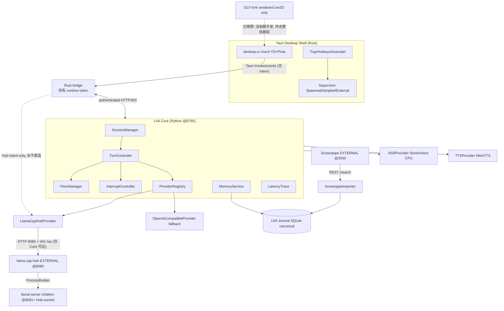

# LocalVoiceAgent — 架构收敛与实施 Plan（v1.1，2026-09-21）

> ⚠️ **SUPERSEDED**：本文件已被 `docs/ARCHITECTURE-PLAN-2026-09-v1.2.1.md`（v1.2.1 冻结版）取代。
> v1.2.1 修正了本版的以下错误：auto-load 误当 auto-unload、Hub load DTO 简化、"current model" 误为 Hub 全局状态、
> deepseek key "已泄露" 的无实证断言、全局 CAS 粒度、Privacy Pause 范围声明等。保留本文档仅作历史记录与修订脉络。
> **施工一律以 v1.2.1 为准。**

> 基于本地 main `cf1c967`（与 origin/main 同步）实际代码核对 + 全部 reference project 实读。
> 本文件是施工蓝图，拆分为 Part 0–17 + 附录。

## v1.1 修订记录（评审后修正，2026-09-21）

| # | 严重度 | 修正 | 位置 |
|---|---|---|---|
| 1 | P0 | Git 历史清洗从普通 PR 抽出，改为 **Phase -1 Security Maintenance Window**，先于一切 worktree 创建 | Part 6 / 附 2 |
| 2 | P0 | UI↔Core transport 定死：`Vue → Tauri invoke/events → Rust bridge → authenticated HTTP/WS → Core`；runtime token 永不进入 WebView | Part 2 |
| 3 | P0 | Hub lifecycle 唯一控制路径：所有 load/unload/switch 只能经 **LVA Core → LlamaCppHubControlClient**；Tauri/UI 只发 intent；浏览器永不直连 Hub | Part 2/3/5/6 |
| 4 | P0 | PR/worktree ownership 碰撞修正：`server.py` 仅 C、`tray.rs` 仅 B、PR-013→B、PR-019→UI-C、PR-029→C；每 PR 单一 owner | Part 9/10/11 |
| 5 | P1 | `CancellationToken` 增加 `async wait_cancelled()`（asyncio-native），task 中止仍由 `Task.cancel()`/stream close 负责 | Part 4 |
| 6 | P1 | Journal 引入 **Revision Model**：`events` 存 current，`event_revisions` 存全部纠正历史；FTS5 设计闭环（event_id UNINDEXED + writer 显式同步） | Part 7 |
| 7 | P1 | Authority Matrix 新增 **AudioCapture Authority = LVA Core**；Screenpipe 为 optional parallel archive，不参与 Live floor/VAD 决策 | Part 3 |
| 8 | 修正 | PR-027 自依赖删除；Merge Train 改为 wave 并发模型（Journal/UI-A 不互相阻塞） | Part 11/12 |
| 9 | 修正 | barge-in 验收拆三指标（detect→commit / commit→stop requested / onset→acoustic silence），acoustic 指标须先实测基线；删除凭空的 <10ms | Part 14 |
| 10 | 修正 | VRAM 验收绑定 **Reference Runtime Profile**（Spark-X2.5-4B Q8 / ctx 8192 / ASR+TTS CPU / 1 Live session） | Part 14 |
| 11 | 安全 | Hub **loopback 绑定是主防线**，apiKey 仅为附加；pin v0.9.8.3 升级为 Compatibility Contract（未知版本 → DEGRADED + capability probe） | Part 5.5 |
| 12 | 明确 | OLV 终态两阶段写死：迁移期 renderer bridge（脚手架，不投入美化）→ 终态 Live2D 嵌入 desktop-ui、OLV 进程整体删除 | Part 6/16 |

---

# Part 0 — Repo Reality Check（实测，非假设）

## 0.1 当前目录结构（真实）

```
E:\AI\LocalVoiceAgent\
├── src\lva\                  # Core A：自研 VoiceCore（Python, FastAPI, sherpa-onnx）
│   ├── pipeline.py   (35.7KB)  VoiceCore / Mode / FloorOwner / Vad / TurnMetrics / barge-in
│   ├── server.py     (13.9KB)  FastAPI HTTP+WS  @127.0.0.1:8765
│   ├── llm.py        (6.4KB)   OpenAI-compatible client → 127.0.0.1:1234/v1（裸 llama-server）
│   ├── asr.py / tts.py / vocab.py / memory.py / audio.py / config.py / textutil.py
│   └── __main__.py
├── apps\
│   ├── desktop-shell\        # Tauri 壳（Rust）+ ui\(index.html, settings.html)
│   │   └── src-tauri\src\    process_manager.rs / lib.rs / tray.rs / settings.rs /
│   │                         crypto.rs / paths.rs / hotkey.rs / autostart.rs
│   ├── open-llm-vtuber\      # Core B：深度修改的 OLV fork（FastAPI @12393 + Live2D 前端）
│   │   └── src\open_llm_vtuber\conversations\  turn_context.py / conversation_handler.py /
│   │                           single_conversation.py / tts_manager.py / latency_trace.py
│   │       memory_router.py  直读 Screenpipe SQLite + jieba + FTS5
│   └── screenpipe\           # node_modules 里的 screenpipe CLI（仅运行时依赖）
├── services.json  settings.json  user_profile.json   # ⚠️ 真实用户配置 commit 在 repo 根
├── data\ recordings\ screenpipe-data\ models\ vocabulary\ voices\ logs\
├── benchmarks\  scripts\  docs\  acceptance-20260917\
├── venv\  tools\w64devkit\  web\live2d\haru
└── lva-pet.exe  lva-pet_0.1.0_x64-setup.exe  WebView2Loader.dll  # ⚠️ 构建产物 commit 在 repo
```

## 0.2 当前运行拓扑（真实）

```
Tauri lva-pet.exe
  ├─ spawn/adopt: llama-server.exe  @1234   ← 直接引用 LM Studio 后端路径（services.json）
  ├─ spawn/adopt: open-llm-vtuber   @12393  ← 深度修改 fork，含独立 TurnContext/memory_router
  ├─ spawn/adopt: screenpipe.exe    @3030   ← record --disable-vision
  └─ ui\index.html (pet 窗) + ui\settings.html (设置窗)

src\lva (VoiceCore) @8765 —— 独立第三套系统，与 OLV 并存；OLV routes.py 里有 lva_* 桥接端点
```

**三处 conversation 逻辑并存（P0 问题确认）**：
1. `src/lva/pipeline.py::VoiceCore` — Mode/FloorOwner/turn_id/barge_in/cancel_turn（完整自研）
2. `apps/open-llm-vtuber/.../conversations/` — TurnContext/turn_counters/active_turn_contexts/LatencyTrace（第二套）
3. `apps/desktop-shell` tray 直接操作模型切换（第三处控制权）

## 0.3 LM Studio / llama-server legacy 清单（实测命中）

| 位置 | 内容 | 处置 |
|---|---|---|
| `services.json` (repo 根!) | `llama_server.executable` 指向 `C:\Users\a.gide\.lmstudio\extensions\backends\...\llama-server.exe`，args 含 `-m W:\model\...gguf -ngl 99` | **DELETE + MIGRATE** |
| `settings.json` (repo 根!) | 含真实 `cloud_api_key_enc` DPAPI 密文、真实 gguf 路径 | **DELETE from repo**（安全问题） |
| `user_profile.json` (repo 根) | 个人 profile | **DELETE from repo** |
| `src-tauri\src\process_manager.rs` | `find_pid_by_port()` via netstat、`taskkill /PID /T /F`、`unload_vram()`、`cold_start_llm()`、`switch_model()`、`shutdown_all_services()` 杀 1234/12393 端口进程 | **REWRITE**（见 PR-004/013） |
| `src-tauri\src\lib.rs` | `scan_models`/`refresh_models`/`switch_llm_model`/`cold_start_llm`/`unload_vram` 命令；启动时 auto-spawn llama_server@1234 + OLV@12393 | **REWRITE** |
| `src-tauri\src\settings.rs` | `GgufModelInfo`、`local_gguf_path`、GGUF 后台扫描器 `start_background_scanner()` | **MIGRATE → Hub 模型列表** |
| `src-tauri\src\tray.rs` | "释放显存(卸载LLM)"/"冷启装载LLM"/"选择/切换LLM模型" 菜单项 | **REPLACE → Hub adapter 调用** |
| `src-tauri\services.default.json` | 同 services.json 模板 | **REWRITE** |
| `ui\settings.html` | GGUF 模型选择/切换 UI（22KB 单文件） | **REPLACE in UI-C** |
| `src\lva\config.py` | `LLM_BASE_URL=...:1234/v1`、`LLAMA_SERVER_PORT=1234` | **MIGRATE → Hub 8080** |
| `src\lva\llm.py` | 直连裸 llama-server（base_url 可配，client 本身可复用） | **KEEP，改默认指向** |
| `scripts\llm_serve.py / start-all.ps1 / stop-all.ps1 / health-check.ps1 / bench_desktop_shell.py / measure_resources.py / privacy-audit.ps1 / test_p3_features.py` | 全部围绕裸 llama-server @1234 + taskkill | **REWRITE/DELETE** |
| `apps\open-llm-vtuber\` 内 LM Studio 引用 | 上游 OLV 自带文档/配置模板（README*.md、config_templates、stateless_llm_factory） | **DEPRECATE**（随 OLV adapter 边缘化） |
| `docs/MASTER_PROMPT.md / architecture-decisions.md / DESKTOP-SHELL-*.md / DEPLOYMENT_REPORT.md / benchmarks\*.md / acceptance-20260917\` | 历史文档中的 LM Studio/1234 叙述 | **KEEP as history，不删** |

**当前 llama.cpp-hub 支持：零。** 全 repo 无任何 hub 引用。

## 0.4 已有资产（KEEP）

- `src/lva/pipeline.py`：Mode(IDLE/RECORDING/LIVE)、FloorOwner、turn_id、cancel_turn、barge-in 三级（candidate→grace→commit）、bounded queues、AEC(WebRTC AEC3)、backchannel 检测、TurnMetrics —— **LVA Core 的合格前身，演进而非重写**
- `src/lva/asr.py`：sherpa-onnx SenseVoice/paraformer/qwen3asr，CPU，统一 `load()/transcribe()` 接口，benchmark 数据支撑选型
- `src/lva/vocab.py`：拼音+字母单元对齐的术语纠正器（"一地的"→"EDTA"），25KB 核心资产
- `src/lva/memory.py`：SQLite FTS5 external-content + CJK 分词 + `utterances(ts, source, raw_text, fixed_text, domain, audio_path)` —— Journal 的前身
- `src/lva/tts.py`：MeloTTS sherpa-onnx 流式，8 线程实测调优
- `src-tauri` crypto.rs(DPAPI)/paths.rs/autostart.rs/hotkey.rs、tray.rs 的窗口管理（toggle/dormancy/trim_working_set/Named Event IPC）
- OLV fork 里的 Live2D 前端资产 + `turn_context.py`/`latency_trace.py` 的设计思路（迁移进 Core，不在 OLV 保留）
- 测试：repo 根无 tests/ 目录；OLV fork 内有 test_invariants.py / test_v2_comprehensive.py / test_disconnect_cleanup.py（仅覆盖 OLV 侧）

## 0.5 安全债务（实测）

1. `settings.json`（含 DPAPI 密文 + 真实路径）、`user_profile.json`、构建产物 `.exe/.dll`、screenpipe-data、recordings 全部 commit 在 git 历史中 → 需要 gitignore + 历史清洗（filter-repo 或至少后续 commit 移除 + 轮换 deepseek key）
2. `src/lva/server.py` @8765 与 OLV @12393：HTTP/WS 均无 token/Origin 校验（仅有 "loopback only" 注释）
3. `settings.rs` 注释写明 "Plaintext in memory, DPAPI on disk"，`get_settings` 命令直接返回 `AppSettings`（含解密后 api_key 字段）给前端 → 违反 §25

---

# Part 1 — Reference Project Matrix（全部实读，2026-09-21）

| Project | Area | LVA 采用 | 不采用 | 关键代码/模块 | Risk |
|---|---|---|---|---|---|
| **AIRI** `moeru-ai/airi` (MIT,★49k) | 前端IA/桌面伴侣UX | ①多窗口=单Vue代码+`window-context`判别 ②Controls Island组件化(control-button/fade-on-hover/indicator-mic-volume/placement composable) ③Settings两级模型Providers(连接)/Modules(能力) ④devtools独立窗口树 ⑤Memory拆long/short-term | ①**Electron主进程代码**(AIRI已从Tauri迁走——LVA须先做Tauri多窗口+click-through spike,这是前车之鉴) ②45包粒度(LVA最多4包) ③gaming/vision集成 | `stage-tamagotchi/src/main/windows/*`、`stage-islands/`、`stage-pages/settings/{providers,modules}` | Tauri窗口能力未验证(P0 spike) |
| **Open-LLM-VTuber** | 语音pipeline/Live2D | ①asr/tts/llm factory模式 ②WS MessageType分组 ③heard_response补偿(interrupt时把已播部分写回上下文) ④Live2D前端资产 | ①**不再有第二套Conversation Core**(fork里turn_context等迁入src/lva后删OLV侧) ②JSON数组传音频 ③无世代防护的事后interrupt | fork内`conversations/{turn_context,conversation_handler,tts_manager,latency_trace}.py` | v2方向UNVERIFIED,LVA不再追upstream |
| **OLV-Web** | Live2D渲染 | 渲染管线参考 | 整个前端框架 | `frontend/` | 同上 |
| **GLaDOS** `dnhkng/GLaDOS` (★5.7k) | 语音控制平面 | ①pre-roll环形缓冲800ms ②`interruptible`开关 ③queue带`_enqueued_at`+`_lane` ④`ShutdownOrchestrator` | 线程+全局Event隐式状态机;无partial;Levenshtein唤醒hack | `core/speech_listener.py`(PAUSE_LIMIT=640ms)、`core/shutdown.py` | 回声自激官方已知,AEC必须做好 |
| **Vocalis** `Lex-au/Vocalis` (停更) | 实时pipeline | ①`interrupt_playback=asyncio.Event()`+`current_audio_task`取消原语 ②TTS_START/CHUNK/END三元组 ③延迟预算表(ASR≤100ms) | JSON+base64传音频;1235行上帝websocket.py;无turn概念 | `routes/websocket.py::MessageType` | 仅参考 |
| **voice2** | turn/Floor | — | — | — | **UNRESOLVED REFERENCE**:多路搜索无可信upstream。OLV fork的`turn_context.py` docstring引用`voice2/turn_context.py`,说明历史开发者接触过某私有/已删repo。三层gate以本地fork现存代码为准,不再追上游 |
| **llama.cpp-hub** `IIIIIllllIIIIIlllll/llama.cpp-hub` (★388,v0.9.8.3,2026-09-07) | **LLM Runtime Authority** | ①`POST /api/models/load {modelId}`/`stop` ②`GET /api/models/list\|loaded` ③`POST /v1/chat/completions`(SSE,8080代理到8081+子进程) ④`WS /ws`订阅modelLoad/modelStop事件 ⑤`PUT /api/auto-load/policy`(自动卸载) ⑥launch profiles(`config/launch_config.json`) ⑦mmproj/draft/MTP支持 | ①~~`/health`~~(不存在,用`GET /api/sys/version`) ②~~原子switch~~(不存在,LVA编排stop→load) ③~~keep-alive/sleep~~(不存在,用autoUnload模拟) ④~~Ollama/LMStudio兼容层~~(已移除/deprecated,勿依赖) ⑤~~`--port`管理~~(hub从8081自动分配) | `docs/API.md`、`LlamaServerManager.java`、`LlamaCppProcess.java`、`AutoLoadPolicyController.java` | **作者已宣布暂停维护**(README顶部)。Mitigation: pin v0.9.8.3, adapter层隔离, 保留OpenAI-compatible fallback |
| **llama.cpp** `ggml-org/llama.cpp` | 推理引擎(仅经hub间接用) | slot模型理解;无/cancel→断SSE即取消;context shift默认关→LVA自己做token预算 | LVA直接管理llama-server进程/参数(全部交hub) | `tools/server/server-{context,queue,stream}.cpp` | REST API每版本几乎breaking→pin版本 |
| **Screenpipe** `mediar-ai/screenpipe` (★21.6k,极活跃) | Raw reality capture | ①event-driven capture思路 ②FTS5 external-content模式 ③write_queue单写者 ④数据层权限强制 | ①**不能vendor/fork代码**(personal/non-commercial license) ②LVA Journal schema不绑定其内部表(2026激进重构中) ③默认开启的PostHog/Sentry | `crates/screenpipe-{audio,db}/`、REST`:3030/search` | schema快速演进→importer走REST优先,直读SQLite仅fallback且做版本探测 |
| **RealtimeSTT** `KoljaB/RealtimeSTT` | ASR pipeline | pre-roll 1.0s、realtime/final双通道 | 线程模型 | `audio_recorder.py` | — |
| **RealtimeTTS** `KoljaB/RealtimeTTS` | TTS pipeline | ①`feed(generator).play_async()` pull式 ②首片段快路径(`fast_sentence_fragment`/`minimum_first_fragment_length`) ③`stop()`完整语义(停合成+停播放+清迭代器)=LVA TTS cancel语义模板 | 线程+generator模型(LVA用asyncio);NLTK分句 | `text_to_stream.py::TextToAudioStream` | 引擎license混杂 |
| **sherpa-onnx** `k2-fsa/sherpa-onnx` | 低资源音频runtime | ①SenseVoice CPU RTF 0.034(LVA实测一致) ②hotwords仅transducer模型支持(SenseVoice不支持→术语靠vocab.py后处理,已验证路线) ③Windows Python部署 | — | LVA `src/lva/asr.py`已在用 | — |
| **unspeech** `moeru-ai/unspeech` (AGPL) | speech provider抽象 | 注册中心模式:每provider一module,统一`provider/model`复合ID | 复制代码(AGPL) | `backend.go`注册中心 | 只参考设计 |
| **xsAI** `moeru-ai/xsai` (MIT) | provider接口风格 | ①"无万能抽象层":baseURL+apiKey即接口,能力×时态(generate/stream)正交 ②22KB级按需组合 | 完全不做抽象(LVA仍需薄注册中心管重试/凭证/模型枚举) | `packages/{generate,stream}-{text,speech,transcription}` | 0.x breaking |
| **MoeChat** `AlfreScarlet/MoeChat` (GPL-3.0) | 中文伴侣/时间记忆 | ①**jionlp中文时间解析→区间→bisect on sorted timestamps的确定性temporal routing**(~80ms) ②时间区间粗筛+embedding精排两级召回 ③按天分片JSONL | 每条记忆预存向量全量驻内存;每轮同步LLM打tag;复制代码(GPL) | `utils/long_mem.py` | 只参考设计 |
| **AkaneCompanionLab/Akane temporal** | temporal memory | — | — | — | **NEEDS SOURCE CONFIRMATION**:GitHub用户404、搜索0结果,不存在可验证项目。最可能实际指向MoeChat实现。**未拿到原始URL前不作为架构依据** |
| **Persona Engine** `elevenyellow/handcrafted-persona-engine` | 桌面overlay | 透明overlay/always-on-top/桌面交互/VBridger-style lip sync思路 | 原生C++实现(LVA用Tauri) | — | 参考交互不参考实现 |
| **LingChat** `SlimeBoyOwO/LingChat` (AGPL) | 中文伴侣UX | 角色即文件夹组织、按角色隔离的记忆UX、中文UX细节 | 复杂剧情系统、emotion simulation、复制代码(AGPL) | — | 素材版权混杂是反面教材 |
| **ZcChat2** | 轻量驻留参考 | 扁平设置、低内存驻留、"点击托盘=打开主面板"导航哲学 | Qt/C++栈 | — | upstream已确认存在(中文桌面AI宠物,GitHub+Gitee双镜像);仅作"桌宠该多轻"基准参考 |

## Reference Adoption Map

```
Frontend UX   → AIRI(Controls Island/多窗口/两级设置/devtools分离)+Persona Engine(overlay)+ZcChat2(轻量)+LingChat(中文角色)
Voice Runtime → GLaDOS(pre-roll/Event原语/shutdown编排)+Vocalis(cancel原语/TTS三元组)+OLV(heard_response补偿)+voice2(UNRESOLVED,以本地fork为准)
ASR           → sherpa-onnx/SenseVoice(主,CPU)+faster-whisper(initial_prompt+hotwords备用)+RealtimeSTT(dual-lane思路)
TTS           → MeloTTS/sherpa-onnx(主)+RealtimeTTS(feed/stop语义)+unspeech(抽象)
Provider Layer→ xsAI(能力×时态正交)+unspeech(注册中心)+AIRI(Providers/Modules分离)
Model Runtime → llama.cpp-hub(唯一authority)+llama.cpp(仅理解其slot/cancel限制)
Memory        → Screenpipe(raw source,REST importer)+MoeChat(jionlp确定性temporal routing)+LVA memory.py(FTS5 CJK)
Live2D        → OLV(渲染资产)+AIRI(交互)+Persona Engine(overlay)
```

---

# Part 2 — Architecture Decision

## ASCII

```
                        Windows 11 Desktop
   +----------------------------------------------------------+
   |              Tauri Desktop Shell (Rust)                  |
   |  windows / tray / autostart / hotkeys / geometry         |
   |  LVA-owned process supervisor (Spawned/Adopted/External) |
   +---------------+------------------------------------------+
                   | Tauri IPC (commands + events)
        +----------v-----------+
        |  Rust bridge          |  持有 runtime token;
        |  (src-tauri/bridge.rs)|  WebView 永远见不到 token
        +----------+-----------+
                   | authenticated HTTP/WS (Bearer+Origin)
                   v
+---------------+    +-------------------------+
|  desktop-ui    |    |      LVA Core (Python)   |
|  Vue3+TS+Pinia |    |  FastAPI @127.0.0.1:8765 |
|  character/chat|    |  SessionManager          |
|  /memory/setti |    |  TurnController          |
|  ngs/services/ |    |  FloorManager            |
|  diagnostics   |    |  InterruptController     |
+-------+--------+    |  RuntimeState            |
        |             |  ProviderRegistry        |
        v             |  MemoryService           |
   Live2D renderer    |  LatencyTrace / EventBus |
   (OLV 资产,          +---+----------+--------+--+
    迁移期脚手架,           |          |        |
    终态整体删除)            v          v        v
                        ASR        LLM      TTS
                   (sherpa-onnx    |    (MeloTTS
                    SenseVoice,    |     sherpa-onnx)
                    CPU)           |
                                   v
                    +------------------------------+
                    |   LlamaCppHubProvider        |  ← 唯一 Hub 控制路径
                    +--------------+---------------+
                                   | HTTP 8080 + WS /ws (仅 Core 可达; UI/浏览器不直连)
                                   v
                    +------------------------------+
                    |   llama.cpp-hub (EXTERNAL)   |
                    |   Java/Netty @8080           |
                    +--------------+---------------+
                                   | ProcessBuilder
                                   v
                    llama-server children @8081+ (Hub-owned)

   Screenpipe (EXTERNAL @3030, raw reality capture)
        | REST /search
        v
   ScreenpipeImporter --> LVA Journal (SQLite, canonical memory)
```

## Mermaid



---

# Part 3 — Authority Matrix

| 关注点 | Owner | 约束 |
|---|---|---|
| Windows/托盘/热键/自启/窗口几何 | **Tauri Desktop Shell** | — |
| LVA-owned 进程生命周期 | **Tauri Supervisor** | 只停 `Spawned`;`Adopted`/`External` 只观察;`Unknown` 永不 kill |
| Session | **LVA Core SessionManager** | — |
| Turn (current 唯一真相) | **LVA Core TurnController** | 一 Session 一 current Turn (I02) |
| Floor | **LVA Core FloorManager** | NONE/USER/AGENT |
| Interrupt 决策与提交 | **LVA Core InterruptController** | 事务化 |
| **AudioCapture (麦克风独占/读取)** | **LVA Core** | 唯一 mic 消费者; **Screenpipe 是 optional parallel archive/import source, 不得参与 Live floor/VAD 决策**; Privacy Pause 时 Core 物理停流(I09) |
| ASR 调度 | **LVA Core** (经 ASRProvider) | engine 可换 |
| LLM 推理调度 | **LVA Core** (经 LLMProvider) | — |
| **模型 inventory/load/unload/profile/版本** | **llama.cpp-hub** | LVA 只经 Hub API 请求,**永不直接 spawn/kill llama-server**; **唯一控制路径 = LVA Core → LlamaCppHubControlClient**, Tauri/UI 只发 intent, 浏览器/WebView 永不直连 Hub API |
| TTS 调度 | **LVA Core** (经 TTSProvider) | — |
| 应用记忆 (canonical) | **LVA Journal** | raw_text immutable; corrected_text versionable |
| 现实采集 (raw) | **Screenpipe** | 不是 LVA application DB |
| 渲染 / Live2D | **Renderer (OLV 资产)** | 无 conversation 逻辑 |
| 会话逻辑 | **只能 LVA Core** | OLV 不得保留 Conversation Core |

**Ownership Invariant (I04/I15)**: `Spawned->可停` `Adopted/External->只观察不自动kill` `Unknown->永不kill`。LVA 永不 taskkill hub 或 hub-owned llama-server。

---

# Part 4 — Contract Freeze

`src/lva/contracts.py` (新, 唯一 owner = Workstream C):

```python
from dataclasses import dataclass, field
from enum import Enum
import asyncio, threading, time

@dataclass(frozen=True)
class SessionId: value: str

@dataclass(frozen=True)
class TurnId:
    session_id: str
    sequence: int            # 单调递增, per session

class Mode(str, Enum):
    STANDBY = "standby"                    # mic off, LLM/TTS asleep, character available
    PASSIVE = "passive"                    # mic+VAD+ASR+Journal active; LLM/TTS NEVER auto-invoked (I07/I08)
    LIVE    = "live"                       # VAD->ASR->LLM->TTS, barge-in
    PRIVACY_PAUSE = "privacy_pause"        # mic capture = OFF, 一级状态 (I09)

class FloorOwner(str, Enum):
    NONE="none"; USER="user"; AGENT="agent"

class ActivityState(str, Enum):
    IDLE="idle"; LISTENING="listening"; TRANSCRIBING="transcribing"
    THINKING="thinking"; SPEAKING="speaking"; INTERRUPTING="interrupting"; ERROR="error"

class ServiceState(str, Enum):
    STOPPED="stopped"; STARTING="starting"; READY="ready"; SLEEPING="sleeping"
    DEGRADED="degraded"; ERROR="error"; STOPPING="stopping"; EXTERNAL="external"

class ProviderState(str, Enum):
    DISCONNECTED="disconnected"; CONNECTING="connecting"; READY="ready"
    BUSY="busy"; ERROR="error"; UNAVAILABLE="unavailable"

class Ownership(str, Enum):
    SPAWNED="spawned"; ADOPTED="adopted"; EXTERNAL="external"; UNKNOWN="unknown"

class CancellationToken:
    """同步可查询 + asyncio-native 等待。真正的中止动作由调用方执行
    (Task.cancel() / SSE stream close / generator.close()); 本类只传递意图。"""
    def __init__(self):
        self._sync = threading.Event()
        self._async: asyncio.Event | None = None   # 惰性绑定到运行中的 loop
        self._loop: asyncio.AbstractEventLoop | None = None
    def cancel(self) -> None:
        self._sync.set()
        if self._async is not None and self._loop is not None:
            self._loop.call_soon_threadsafe(self._async.set)
    @property
    def cancelled(self) -> bool:
        return self._sync.is_set()
    async def wait_cancelled(self) -> None:
        if self._async is None:
            self._loop = asyncio.get_running_loop()
            self._async = asyncio.Event()
            if self._sync.is_set():
                self._async.set()
        await self._async.wait()

@dataclass
class RuntimeState:
    mode: Mode = Mode.STANDBY
    session_id: SessionId | None = None
    current_turn: TurnId | None = None
    floor: FloorOwner = FloorOwner.NONE
    activity: ActivityState = ActivityState.IDLE

@dataclass
class TurnEvent:    # turn_begin/turn_cancelled/turn_committed/interrupt_committed
    kind: str; turn_id: TurnId
    ts: float = field(default_factory=time.time); payload: dict = field(default_factory=dict)

@dataclass
class AudioEvent:   # vad_start/vad_end/utterance_ready/playback_start/playback_silenced
    kind: str; turn_id: TurnId | None
    ts: float = field(default_factory=time.time); payload: dict = field(default_factory=dict)

@dataclass
class MemoryEvent:  # memory_committed/recall_done
    kind: str; turn_id: TurnId | None
    ts: float = field(default_factory=time.time); payload: dict = field(default_factory=dict)

@dataclass
class ErrorEvent:
    kind: str = "error"; message: str = ""; source: str = ""
    turn_id: TurnId | None = None; ts: float = field(default_factory=time.time)
```

**三层 stale-turn gate**: (1)任务开始前 `turn.is_current` (2)stream 中检查 cancelled/current (3)所有 external side effect (audio playback/frontend response/avatar animation/history mutation/memory commit) 前 `payload.turn_id == current_turn_id`, 否则丢弃。即使旧模型无法真正 cancel, 晚返回必须被 Gate 3 丢弃。

**LatencyTrace 统一事件**: `speech_start/speech_end/endpoint_detected/asr_start/asr_done/llm_request/llm_first_token/tts_request/tts_first_sample/playback_start/interrupt_detected/interrupt_committed/playback_silenced`; 自动算 endpoint/ASR/LLM-TTFT/TTS-TTFA/E2E-TTFA/barge-detect/barge-commit/barge-acoustic 延迟。

---

# Part 5 — llama.cpp-hub Integration (基于实读,非假设)

## 5.1 Hub 事实 (克隆源码 + docs/API.md)

- 形态: Java 21 + Netty, 单 JVM 进程; `llama-server` 是其 `ProcessBuilder` **child process** (8081+ 自动分配端口)
- 主端口 **8080**: WebUI + OpenAI 兼容推理 + 全部管理 API + `WS /ws`
- 维护: v0.9.8.3 (2026-09-07, 绑 llama.cpp b10830); README 声明作者暂停维护 -> **pin 版本 + adapter 隔离 + fallback**

## 5.2 LVA Adapter (拆两个 client, 不强行合并)

`src/lva/providers/llamacpp_hub.py` (新):

```python
class LlamaCppHubControlClient:      # 管理面 @8080
    def discover(endpoint)      # GET /api/sys/version
    def health()                # 轮询 /api/sys/version (无 /health!)
    def list_models()           # GET /api/models/list (含未加载)
    def loaded_models()         # GET /api/models/loaded (port/pid/busy)
    def request_load(model_id, profile=None)   # POST /api/models/load
    def request_unload(model_id)               # POST /api/models/stop
    def set_auto_unload(model_id, timeout_ms)  # PUT /api/auto-load/policy
    def get/set_model_config(model_id, ...)    # launch profiles
    def watch_events(on_event)  # WS /ws: modelLoad/modelStop/model_busy

class LlamaCppInferenceClient:       # 推理面 @8080 (OpenAI-compatible)
    def stream_chat(messages, model, ...)   # POST /v1/chat/completions (SSE)
    def cancel()                            # = 断开 SSE (llama-server 无 /cancel)
```

## 5.3 集成问题答案

| 问题 | 答案 |
|---|---|
| discovery | 配置 `hub_endpoint` (默认 `http://127.0.0.1:8080`), `GET /api/sys/version` 探测 |
| health | **无 /health** -> 轮询 `/api/sys/version` + `/api/models/loaded` |
| inventory | `GET /api/models/list`; LVA **不再扫描任何 GGUF 目录** |
| status | `GET /api/models/loaded` (port/pid/busy) + `WS /ws` 事件 |
| switch | **无原子端点** -> LVA 编排: cancel current Turn -> `stop old` -> `load new` -> 等 `WS modelLoad(success=true)` -> Provider READY -> 允许新 Turn (I14) |
| unload | `POST /api/models/stop {modelId}`; VRAM 释放由此完成, **LVA 不再 taskkill** |
| inference | `POST /v1/chat/completions` (SSE); 可设 auto-load policy 冷启动 (阻塞最长 120s, client timeout >120s) |
| streaming | SSE; `reasoning_content` 与 `content` 分离 (`src/lva/llm.py` 已支持) |
| Hub restart | WS 断开 -> ProviderState.DISCONNECTED -> 指数退避重连 -> 恢复后刷新 inventory |
| Hub unavailable | Passive/Memory/Character/Settings 继续; 仅 Live inference 降级 |
| fallback | `OpenAICompatibleProvider` (任意 OpenAI 端点含云端) |
| legacy 移除 | PR-013 删 process_manager.rs 全部 llama-server 管理 + services.json llama_server 条目 |

## 5.4 Hub 不具备 -> LVA 补偿

1. 无原子 switch -> LVA 编排 (见上)
2. 无 keep-alive/sleep -> 用 `auto-load/policy` 的 autoUnload 模拟 "Sleep AI"
3. 管理 API 无认证 -> hub 仅监听 loopback; LVA 侧不暴露
4. VRAM 估算对 mmproj/draft 不准 -> LVA 切换前提示, 不在 LVA 侧估算
5. llama-server 无 /cancel -> 断 SSE 即取消, 晚到 token 由 Gate 3 丢弃; 建议 hub profile 用 `--parallel 2` 减少 slot 排队

## 5.5 Hub 安全模型与版本契约 (v1.1 强化)

**安全分层 (顺序不可颠倒)**:

1. **主防线 = loopback 绑定**。Hub 默认监听 `0.0.0.0` 且 README 明示无互联网级防护 → 部署要求 Hub 绑定 `127.0.0.1`。`security.apiKeyEnabled=true` **只是附加防线, 不得当作主要保护**。
2. **WebView/浏览器永不直连 Hub**。Hub endpoint 与任何凭证只存在于 LVA Core 进程内; UI 对 Hub 的一切操作经 `Vue → Tauri intent → Core → Hub`。Hub WebUI (8080) 仅由用户主动经 `[Open llama.cpp-hub]` 在系统浏览器打开, 不嵌入 WebView, 不作为 LVA 功能链路。
3. LVA 启动时探测 Hub 实际绑定地址 (读 Hub 配置或尝试外部接口可达性自检), 非 loopback 即在 Services 页红色警告。

**Compatibility Contract (pin 不是建议, 是契约)**:

```
supported_hub_versions = ["0.9.8.3"]     # adapter 单测/契约测试只钉这些版本

启动握手:
  GET /api/sys/version
    → 版本 ∈ supported 且 API smoke (list/loaded/version) 全过 → READY
    → 版本未知/更新                     → DEGRADED:
        逐一 probe 能力 (list_models 可用? load/stop 可用? WS 事件可用?)
        缺失能力对应功能禁用并明示, 不崩溃, 不静默假设
    → 不可达                            → UNAVAILABLE (§65 降级)
```

**禁止把 master 分支文档当作 pin 版本的 API 事实** (上游 README 已出现"兼容层已移除"与文档残留不一致的实例)。adapter 的每个 endpoint 调用都须有对应的契约测试 (tests/contract/test_hub_v0_9_8_3.py)。

---

# Part 6 — Backend Migration (按 Phase)

## Phase -1 — Security Maintenance Window (先于一切 worktree, 串行, 半天)

> **v1.1 P0 修正**: `git filter-repo` 重写全部 commit SHA, 与任何已存在的 worktree/branch 不兼容。因此历史清洗**不是 PR, 是开工前置事件**。窗口关闭前不得创建任何并行 worktree。

1. 轮换 deepseek key (已泄露, 与清洗无关也必须做)
2. 冻结开发; 确认无未 push 工作
3. `git bundle create backups/git-bundles/pre-filter-repo-<date>.bundle --all`
4. `git filter-repo --path settings.json --path services.json --path user_profile.json --invert-paths` (先列大文件评估是否追加 .exe/.dll/screenpipe-data/recordings/venv)
5. 更新 `.gitignore` + 提交 `settings.example.json` / `services.example.json`
6. force-push; 打 tag `baseline-architecture-2026-09` 记录**新 baseline SHA** (本 Plan 引用的 `cf1c967` 自此失效)
7. 所有人 fresh clone; 验证 `git grep -i "sk-"` 零命中
8. 详细预案与 rollback 见附 2

## Phase 0 — 安全与基础 (Week 0-1, 不依赖其他)

- **SEC-2**: `settings.rs` 的 `get_settings` 不再向前端返回 `api_key` 明文, 改返回 `has_api_key: bool` (files: settings.rs, ui/settings.html 兼容; acceptance: 前端 IPC 响应无 `sk-` 前缀字段)
- **SEC-3**: `src/lva/server.py` @8765 加 startup random token (Authorization header) + WS Origin 校验; **token 只交付给 Rust bridge 进程内持有, 不进入 WebView** (files: server.py; 该文件唯一 owner 是 C, A 以 PR 形式提交给 C review 合入; acceptance: 无 token 的 private API 请求 401/403, I10)

## Phase 1 — Contract Freeze (Week 1, 阻塞多数下游)
- **CORE-1**: 新建 `src/lva/contracts.py` (Part 4 内容), 纯定义无副作用
- **CORE-2**: 新建 `tests/` 目录 + pytest 骨架 + 首个 invariant 测试框架

## Phase 2 — Supervisor 收敛 (Week 1-2)
- **SUP-1**: `process_manager.rs` 重构: `ProcessOwnership` 加 `External`/`Unknown`; 删 `shutdown_all_services` 中对 1234/12393 的 taskkill; `safe_shutdown_spawned_only` 保留但只作用 Spawned; llama-server 从 services 管理列表移除 (files: process_manager.rs, lib.rs, tray.rs; acceptance: externally-started hub 在 LVA quit 后仍存活, I04/I15)

## Phase 3 — Hub 集成 (Week 2-3, 依赖 Contract)
- **HUB-1**: `src/lva/providers/llamacpp_hub.py` Control+Inference client + 单测 (mock httpx)
- **HUB-2**: `config.py` 默认 `LLM_BASE_URL` 指向 `http://127.0.0.1:8080/v1`; `LLAMA_SERVER_PORT` 概念删除
- **HUB-3**: Tauri 侧 `switch_llm_model`/`unload_vram`/`cold_start_llm` 命令改为**只向 LVA Core 发 intent** (经 bridge 转发), 由 Core 的 LlamaCppHubControlClient 执行; **Tauri 不得直接 HTTP 调用 Hub 管理面, 不得持有 Hub endpoint 之外的状态**; 删 `scan_models`/`refresh_models`/`GgufModelInfo`/`start_background_scanner`
- **HUB-4**: 模型切换编排 (cancel Turn -> stop old -> load new -> WS modelLoad -> READY), 满足 I14

## Phase 4 — Core 统一 (Week 3-5, 依赖 Contract)
- **CORE-3**: `pipeline.py::VoiceCore` 演进为 SessionManager/TurnController/FloorManager/InterruptController, 用 contracts.py 类型; turn_id 贯穿所有异步产物; 实现三层 gate (I01/I02/I03/I05)
- **CORE-4**: OLV fork 收敛为 renderer **(迁移脚手架, 两阶段终态写死)**:
  - **迁移态**: 删 `conversations/{turn_context,conversation_handler,single_conversation,tts_manager,latency_trace}.py` + `memory_router.py` 的 conversation 职责, 仅保留 Live2D 渲染 + WS 渲染协议, OLV 只消费 LVA Core 事件。**明确禁止投入代码把 OLV 改造成漂亮的新 renderer service —— 它只是脚手架。**
  - **终态**: Live2D runtime/assets (web/ haru+pixi) 直接嵌入 desktop-ui, OLV Python 进程整体删除 (PR-030 后执行)。
  (files: apps/open-llm-vtuber/...; rollback: OLV 作为独立子目录, 可整体保留旧版于 branch)
- **CORE-5**: 删 src/lva 与 OLV 之间的双写; 唯一 Conversation Authority = LVA Core

## Phase 5 — Memory (Week 4-6)
- **MEM-1**: Journal schema 落地 (Part 7), `src/lva/journal.py`, 从 memory.py 迁移
- **MEM-2**: `src/lva/screenpipe_importer.py`, REST 优先, raw event timestamp 保留
- **MEM-3**: temporal routing (jionlp + bisect), FTS5 CJK 沿用 memory.py 的 segment

## Phase 6 — Frontend (Week 3-8, 依赖 Contract 的事件 schema)
见 Part 8 详细拆分 (UI-A~UI-G)

## Phase 7 — 收敛与清理 (Week 8-10)
- **CLEAN-1**: 删 scripts/ 里所有裸 llama-server/taskkill 脚本, 重写为 hub-aware
- **CLEAN-2**: 删 ui/settings.html 的 GGUF 管理, 删 OLV conversation core (若 Phase 4 未删)
- **CLEAN-3**: main 全程可运行验证 + soak 2h/8h/12h

---

# Part 7 — Memory Migration (Screenpipe -> Journal)

## 7.1 Journal schema (`src/lva/journal.py`, 迁移自 memory.py)

```sql
CREATE TABLE IF NOT EXISTS events (
  event_id      TEXT PRIMARY KEY,          -- uuid
  session_id    TEXT,
  turn_id       TEXT,
  ts_event      REAL NOT NULL,             -- 原始事件发生时刻 (immutable, relative-time anchor)
  ts_ingest     REAL NOT NULL,             -- 入库时刻
  started_at    REAL, ended_at REAL,
  speaker       TEXT DEFAULT '',
  source        TEXT NOT NULL,             -- live|passive|screenpipe|typed
  raw_text      TEXT NOT NULL,             -- immutable (I06, trigger 强制)
  corrected_text TEXT NOT NULL,            -- = current revision 文本 (冗余加速读)
  current_revision INTEGER NOT NULL DEFAULT 1,
  audio_ref     TEXT DEFAULT '',
  asr_provider  TEXT DEFAULT '', asr_model TEXT DEFAULT '',
  confidence    REAL DEFAULT 0,
  domain        TEXT DEFAULT 'general',
  provenance    TEXT DEFAULT '{}',         -- json: {importer, screenpipe_frame_id, ...}
  created_at    REAL NOT NULL
);

-- Revision Model (v1.1): 全部纠正历史独立成表, events 只保存 current
-- "洛河 → 络合 → 配位络合" 整条演化链均有证据
CREATE TABLE IF NOT EXISTS event_revisions (
  revision_id     INTEGER PRIMARY KEY AUTOINCREMENT,
  event_id        TEXT NOT NULL REFERENCES events(event_id),
  revision        INTEGER NOT NULL,        -- 1..n 单调
  corrected_text  TEXT NOT NULL,
  correction_rules_version TEXT DEFAULT '', -- 纠正器/词表版本
  reason          TEXT DEFAULT '',         -- vocab_fix|second_pass|manual|reimport
  source          TEXT DEFAULT '',         -- 产生者 (pipeline/second_pass/user)
  created_at      REAL NOT NULL,
  UNIQUE(event_id, revision)
);

-- FTS5 闭环 (v1.1): 普通 FTS 表 + event_id UNINDEXED 映射 + writer 显式同步
CREATE VIRTUAL TABLE IF NOT EXISTS events_fts USING fts5(
  event_id UNINDEXED,                      -- 回查主表的 key
  seg_text, raw_seg,
  tokenize='unicode61');

-- 同步策略 (由 Journal writer 单写者保证, 不用 trigger 做文本同步):
--   INSERT event → 同事务 INSERT events_fts(event_id, segment(corrected), segment(raw))
--   新增 revision → 同事务 DELETE FROM events_fts WHERE event_id=? + 重新 INSERT
--   删除 event   → 同事务删两表
-- raw_text 不可变仍由 trigger 强制:
CREATE TRIGGER IF NOT EXISTS raw_immutable BEFORE UPDATE OF raw_text ON events
BEGIN SELECT RAISE(ABORT,'raw_text immutable'); END;

CREATE INDEX IF NOT EXISTS idx_events_ts ON events(ts_event);
CREATE INDEX IF NOT EXISTS idx_events_session ON events(session_id);
```

关键: `ts_event` 来自 Screenpipe 原始 timestamp, 绝不重写; relative time anchor 基于 `ts_event` ("明天做络合滴定"@2026-09-10 -> 区间查询相对 2026-09-10)。`raw_text` immutable; 纠正演化链在 `event_revisions`, UI 的 correction history 从该表读取。

## 7.2 Importer (`src/lva/screenpipe_importer.py`)

- 优先走 `GET http://127.0.0.1:3030/search` (带 start_time/end_time 过滤) + `/frames/{id}/context`
- fallback: 只读打开 `screenpipe-data/data/db.sqlite`, 先做 schema 版本探测 (上游 2026 激进重构)
- 尊重上游 `redacted_at` 脱敏标记, 跳过已脱敏数据
- 保留 chunk 级 audio offset
- 幂等: provenance 记录 `screenpipe_frame_id`, 重复导入去重

## 7.3 Recall

- **Temporal**: jionlp/dateparser 中文时间表达式 -> 区间 [t1,t2] -> `ts_event` 索引范围扫描粗筛 (MoeChat 模式, ~80ms)
- **FTS**: CJK 分词 (沿用 `memory.py::segment`) -> FTS5 phrase query
- **Semantic**: 留作可选增强层 (不引入向量库重写)
- 确定性优先: 时间解析失败 -> 降级 "最近 N 小时" + FTS 兜底 + 记日志

---

# Part 8 — Frontend Migration

## 8.1 技术栈与新工程

新建 `apps/desktop-ui/` (Vue 3 + TypeScript + Pinia + Vue Router + Vite), 单一代码库 + `window-context` 判别当前窗口 (学 AIRI)。不继续扩张单文件 HTML+inline JS。

**P0 spike 先行**: Tauri 多窗口 + `set_ignore_cursor_events` + 透明 always-on-top + 位置持久化的可行性验证 (AIRI 迁 Electron 是前车之鉴)。若 Tauri 不满足, 在 Part 15 记录并降级方案。

## 8.2 窗口划分 (对标 AIRI windows/)

```
character    透明 always-on-top Live2D 主窗 (无框/click-through/位置+显示器持久化/scale/drag/lock)
chat         对话窗 (独立于 character 生命周期)
settings     设置窗 (唯一完整设置承载)
diagnostics  开发者诊断窗 (普通 UI 只放隐藏入口)
```

## 8.3 信息架构

```
Desktop Character
  +-- Controls Island   [Chat | Mode(Standby/Passive/Live) | Mute | Privacy Pause(高可达) | More>]
  |      More: Character / Always on Top / Auto Hide / Lock / Move / Settings / Reload UI
  +-- Chat              conversation / input / voice control / new chat / history / character
  |      (高级: Turn Diagnostics 显示 turn_id/ASR延迟/LLM-TTFT/TTS-TTFA/memory retrieval/domain)
  +-- Memory            Timeline / Search / Detail(corrected+raw+timestamp+source+audio+engine+confidence+correction history+provenance)
  +-- Settings          General / Character / Conversation Model / Hearing / Speech /
  |                     Memory & Recording / Performance / Services / Privacy & Data /
  |                     Advanced(Providers/Diagnostics/Developer) / About
  +-- Tray              (Part 63 结构)
```

Diagnostics (latency/组件状态/memory retrieval/ASR metrics/events) 全部迁移至 Advanced>Diagnostics, 与普通用户 UI 物理分离。character 正常态只显示 Live2D+status feedback+Controls Island, **禁止常驻** provider/port/PID/memory count/latency/component table。

## 8.4 Conversation Model 页 (Hub 驱动)

普通 UI: Runtime=llama.cpp-hub ●Connected / Current Model=XXX Q4_K_M ●Ready / [Change Model]。模型 inventory **从 Hub 获取** (`GET /api/models/list`), LVA 不扫描 `W:\model`。高级 LLM 设置只暴露: Runtime/Hub endpoint/Auto connect/Preferred model/Connection test + [Open llama.cpp-hub]。`-ngl/-c/-ctk/-ctv/-fa/-np/-b/-ub/-mmproj/KV` 等属于 hub, 不出现在 LVA UI。

## 8.5 迁移顺序 (渐进 strangler)

```
new frontend shell -> compatibility IPC adapter -> migrate Settings -> Chat -> Memory -> Character -> remove legacy HTML
```

旧 `ui/index.html`/`ui/settings.html` 第一步不删, 直到新 UI 对应模块验收通过。

---

# Part 9 — Workstream DAG

```
                  +-------------------+
                  | Contract Freeze   |  (PR-001)
                  | contracts.py      |
                  +--------+----------+
                           |
     +----------+----------+-----------+-----------+
     |          |          |           |           |
     v          v          v           v           v
  Runtime   Hub adapter  OLV adapter  Frontend   Diagnostics
  migration  (G)         (E)          state      schema (F)
  (C)                                 store
                                       (UI-A)
```

Day-1 可并发 (互不依赖; **前提是 Phase -1 Security Maintenance Window 已关闭**, v1.1):
- ARCH: Contract Freeze 起草 (Workstream C lead)
- REF: Reference Review (已完成, 本文件 Part 1)
- SEC: Security cleanup (Workstream A)
- SUP: Supervisor ownership refactor (Workstream B)
- MEM: Journal schema (Workstream D)
- UI-A: Frontend foundation (Workstream UI-A)
- TEST: Test harness (Workstream F)

依赖关系:
- Hub adapter (G) 依赖 Contract
- OLV adapter (E) 依赖 Contract + Core 事件 schema
- UI-B/C/D/E/F/G 依赖 UI-A + Contract
- Legacy removal (CLEAN) 依赖所有 migration 验收

## 共享文件唯一 owner (防撞)

| 共享文件 | 唯一 owner | 其他 workstream |
|---|---|---|
| `src/lva/contracts.py` | C | 只消费, 不改 |
| `src/lva/config.py` | C | A/G 提 PR 给 C |
| `apps/desktop-shell/src-tauri/src/lib.rs` | B | A/G 提 PR 给 B |
| `apps/desktop-shell/src-tauri/src/process_manager.rs` | B | 只 B 改 |
| `apps/desktop-shell/src-tauri/src/settings.rs` | A | 只 A 改 |
| `apps/desktop-shell/src-tauri/src/tray.rs` | **B** | UI-F 提 PR 给 B (v1.1: 原 UI-F 直改已收回) |
| `src/lva/server.py` | **C** | 只 C 改 (v1.1: A 的认证中间件 SEC-3 以 PR 提交给 C review 合入) |
| `apps/open-llm-vtuber/.../conversation_handler.py` | E | 只 E 改 |
| `src/lva/journal.py` / `memory.py` | D | 只 D 改 |

**v1.1 规则**: 每个 PR 恰好一个 owner。跨层需求一律拆 contract/backend/UI 三段分别出 PR, 禁止 "B+G" / "UI-C+G" / "C+E" 这类双 owner PR。

---

# Part 10 — Worktree Plan

| Worktree | Owner | Scope | Allowed files | Forbidden shared files | Depends on |
|---|---|---|---|---|---|
| `wt-a-security` | A | 配置/密钥/localhost 认证 | `settings.rs` `crypto.rs` `.gitignore` `*.example.json` | `lib.rs` `contracts.py` `server.py`(SEC-3 认证以 PR 给 C) | Phase -1 完成 |
| `wt-b-supervisor` | B | 进程 ownership | `process_manager.rs` `lib.rs` `tray.rs` `services*.json` | `contracts.py` `settings.rs` | — |
| `wt-c-core` | C | Runtime core + contracts | `src/lva/{contracts,pipeline,server,config,events}.py` | `memory.py` `journal.py` | Contract |
| `wt-d-memory` | D | Journal/importer/recall | `src/lva/{journal,screenpipe_importer,memory,recall}.py` `vocab.py` | `contracts.py` | Contract |
| `wt-e-olv` | E | OLV renderer adapter | `apps/open-llm-vtuber/` | `src/lva/` | Contract + C 事件 schema |
| `wt-f-test` | F | Tests/observability | `tests/` `src/lva/latency.py` benchmarks | `contracts.py` | Contract |
| `wt-g-hub` | G | Hub integration | `src/lva/providers/llamacpp_hub.py` `src/lva/llm.py` | `process_manager.rs` | Contract |
| `wt-ui-a` | UI-A | 前端 foundation | `apps/desktop-ui/` (scaffold/window-context/pinia/router) | `src-tauri/src/*` | Contract |
| `wt-ui-b` | UI-B | Character/Controls Island | `apps/desktop-ui/src/{windows/character,components/island}` | `src-tauri/src/*` | UI-A |
| `wt-ui-c` | UI-C | Settings | `apps/desktop-ui/src/pages/settings` | `src-tauri/src/*` | UI-A + G(模型页) |
| `wt-ui-d` | UI-D | Chat | `apps/desktop-ui/src/pages/chat` | `src-tauri/src/*` | UI-A + C |
| `wt-ui-e` | UI-E | Memory | `apps/desktop-ui/src/pages/memory` | `journal.py` | UI-A + D |
| `wt-ui-f` | UI-F | Tray/Window | `desktop-ui` window composables + tray 需求清单 | `tray.rs`(B 所有, 提 PR) `process_manager.rs` | UI-A + B |
| `wt-ui-g` | UI-G | Services/Diagnostics | `apps/desktop-ui/src/pages/{services,diagnostics}` | — | UI-A + F |

---

# Part 11 — PR Plan (摘要, 每 PR 含 Branch/Owner/Problem/Target/Files/New files/Steps/Deps/Parallel-safe/Conflicts/Tests/Acceptance/Rollback/Deletion-deferred)

| PR | Branch | Owner | 内容 | 依赖 | Acceptance 关键 |
|---|---|---|---|---|---|
| 001 | `arch/contracts` | C | contracts.py 全量类型 | — | `pytest tests/test_contracts.py` 过; 类型可 import |
| 002 | `sec/untrack-private` | A | git rm cached 私密配置 + .gitignore + example 文件 (历史清洗属 Phase -1, 不在本 PR) | Phase -1 | repo 无真实 secret; example 可渲染 |
| 003 | `sec/no-plaintext-key` | A | get_settings 返回 has_api_key | — | IPC 响应无 sk- 字段 |
| 004 | `sup/ownership` | B | ProcessOwnership+External/Unknown; 只停 Spawned | — | external hub 存活 (I04) |
| 005 | `sec/localhost-auth` | A | 8765 token + Origin | 001 | 无 token 401 (I10) |
| 006 | `core/session-turn` | C | SessionId/TurnId + 单调 sequence | 001 | I02 单 current Turn |
| 007 | `core/cancellation` | C | CancellationToken 贯穿 | 006 | cancel 后 stream 停 |
| 008 | `core/stale-gates` | C | 三层 gate | 007 | I01/I05: stale 不到 playback |
| 009 | `core/providers` | C | ASR/LLM/TTS Provider protocols | 001 | protocol 可 mock |
| 010 | `hub/client` | G | Control+Inference client | 009 | mock httpx 单测过 |
| 011 | `hub/inference` | G | LlamaCppHubProvider 接入 | 010 | 经 hub SSE 出 token |
| 012 | `hub/lifecycle` | G | load/unload/switch 编排 | 010 | I14: switch 不复活旧 Turn |
| 013 | `hub/remove-direct-kill` | **B** | 删 process_manager llama-server 管理 + services.json 条目 (G 提供 client 库, 不动 Rust) | 004,012 | I15: 无 taskkill hub child |
| 014 | `mem/journal` | D | journal.py schema | 001 | raw immutable (I06) |
| 015 | `mem/importer` | D | screenpipe importer | 014 | 幂等; ts_event 保留 |
| 016 | `ui/foundation` | UI-A | desktop-ui scaffold | 001 | 多窗口+window-context 跑通 |
| 017 | `ui/controls-island` | UI-B | Controls Island | 016 | Mode/Mute/Privacy 一键可达 |
| 018 | `ui/settings-shell` | UI-C | Settings IA | 016 | 两级 Providers/Modules |
| 019 | `ui/hub-model` | **UI-C** | Conversation Model 页 (消费 G 的 Core 端点, 不碰 provider 代码) | 012,018 | 从 hub 列模型, 无 -ngl 等 |
| 020 | `ui/hearing` | UI-C | Hearing 页 | 018 | 普通/高级分离 |
| 021 | `ui/speech` | UI-C | Speech 页 | 018 | provider 动态配置 |
| 022 | `ui/chat` | UI-D | Chat 页 | 016,008 | 与 Debug 分离 |
| 023 | `ui/memory` | UI-E | Memory Timeline/Search/Detail | 015,016 | Detail 含 raw+corrected+provenance |
| 024 | `ui/tray-window` | UI-F | Tray + 窗口 UX | 004,016 | Part 63 菜单; 位置持久化 |
| 025 | `olv/renderer` | E | OLV 收敛 renderer | 008 | OLV 无 conversation core |
| 026 | `ui/services` | UI-G | Services 页 (普通/开发者) | 016 | 普通无 PID/port |
| 027 | `ui/diagnostics` | UI-G | Diagnostics 迁移 | 016 | latency/事件流可见 |
| 028 | `test/fault` | F | 故障注入 (Part 71) | 全 | 15 项 fault 通过 |
| 029 | `clean/legacy-core` | **C** | 删 OLV conversation core / 旧 llm 管理 (E 仅验收 renderer 行为) | 025 | main 仍可运行 |
| 030 | `clean/legacy-ui` | UI | 删旧 HTML | 全部 UI PR | main 仍可运行 |

---

# Part 12 — Merge Train (wave 并发模型, v1.1)

> v1.1 修正: 不再串行。Journal 与 Frontend foundation 互不阻塞; OLV renderer bridge 提前到第二波。

```
Wave -1  Security Maintenance Window (串行, 半天, 无 worktree)
         rotate key → freeze → bundle → filter-repo → force-push → fresh clone
         → tag baseline-architecture-2026-09 (新 baseline SHA)
              ↓
Wave 0   Contract + Spike (1-3 天)
         001 contracts │ tests 骨架 │ Tauri spike(透明/click-through/多窗口/位置持久化)
         │ Hub v0.9.8.3 compatibility smoke test
              ↓ (Contract Freeze 达成)
Wave 1   五路并发:
         002/003(A Security) │ 004/005(B Supervisor) │ 010(G Hub client)
         014(D Journal schema) │ 016(UI-A foundation)
              ↓
Wave 2   稳定 Runtime/Event API 之后并发:
         006→007→008→009(C Core migration) │ 011→012(G inference+lifecycle)
         015(D importer) │ 025(E OLV renderer bridge)
         017/018(UI-B 岛 / UI-C Settings shell)
              ↓
Wave 3   013(B 删直连 kill) │ 019/020/021(UI-C 页) │ 022(UI-D Chat)
         023(UI-E Memory) │ 024(UI-F Tray, 提 PR 给 B) │ 026/027(UI-G)
              ↓
Wave 4   028(F fault suite) → soak 2h → 8h → 12h → 029(C) → 030(UI)
```

约束: 同 wave 内 merge 顺序按完成先后, 但跨 wave 硬依赖 (Part 11 Deps 列) 不得插队; 每个 merge 后 main 必须可启动 (compatibility mode 允许)。

---

# Part 13 — Tests

## 13.1 层级

| 层 | 位置 | 内容 |
|---|---|---|
| Unit | `tests/unit/` + `src-tauri #[cfg(test)]` | contracts 序列化往返; Mode 兼容映射(standby/passive/live ⇔ idle/recording/live); journal trigger; hub client (httpx mock); settings v1→v2 迁移; ownership kill 分支 mock |
| Invariant | `tests/invariants/` | I01–I15 一一对应, 见 13.2 |
| Integration | `tests/integration/` | Core+Journal+真实或 stub Hub 全 turn; Hub 切换事务; importer 幂等 |
| Fault | `tests/fault/` | §71 全清单: hub 断连(生成中)/切换中消失/load 失败/重启换 PID/旧响应迟到/rapid interrupt×5/kill TTS/ASR 超时/拔除输入/拔除输出/screenpipe 崩溃/Journal DB locked/前端 reload/Tauri 崩溃/可选云 provider 断网 |
| Soak | `scripts/soak.py` + `benchmarks/` | 2h/8h/12h, Passive 为主; 监控 RAM/VRAM/CPU idle/audio handles/SQLite locks/queue 深度/线程数/WS 重连/Hub 模型装卸周期 |
| UX | `tests/ux/checklist.md` | §81 操作步数检查表 |
| Migration | `tests/migration/` | memory.db→journal.db 校验和; settings/services json 往返 |

## 13.2 Invariant 测试映射 (I01–I15)

| ID | 测试方法 |
|---|---|
| I01 stale turn never reaches playback | 沿用 `benchmarks/test_barge_in.py` + Gate3 注入迟到 payload, 断言 player 零输出 |
| I02 one current Turn per Session | 并发触发 2 turn, 断言 current 唯一、另一被 cancel |
| I03 interrupt returns Floor to USER | commit 后断言 floor==USER 且 INTERRUPT_COMMITTED 已发 |
| I04 adopted/external never auto-killed | Rust 单测 mock ownership map: Adopted/External/Unknown 断言不进 kill 分支 |
| I05 external output carries TurnId | WS 出栈消息 schema 校验器, 缺 turn 字段即 fail |
| I06 raw transcript immutable | `UPDATE raw_text` 必须 RAISE; corrected_text 版本+1 正常 |
| I07/I08 Passive never invokes LLM/TTS | provider mock 计数器, Passive 运行断言零调用 |
| I09 Privacy Pause stops mic | pause 后帧计数归零; UI/Island/Tray 三入口均验证 |
| I10 unauthenticated private API rejected | 无 token/错 Origin → 401/403 |
| I11 provider crash cannot corrupt session | kill provider stub, session 状态一致可恢复 |
| I12 audio callback never blocks | callback p99 < 1ms; 队满丢弃计数而非阻塞 |
| I13 Hub disconnect 不断 Passive | 断 hub, Passive 持续落 Journal, 事件流 DEGRADED |
| I14 model switch 不复活旧 Turn | 切换中注入迟到 token/音频, 全部 Gate3 丢弃无声音 |
| I15 never kills Hub-owned llama-server | 静态扫描 taskkill 白名单 + 运行期: LVA quit 后 hub 及子进程存活 |

## 13.3 现有测试迁移

- 保留: `benchmarks/test_barge_in.py`、`test_ws_turn.py` → `tests/integration/`; `scripts/test_vocab.py` → `tests/unit/`
- 扩展: `scripts/test_p3_features.py` 的 taskkill 禁令 → I04/I15 静态扫描
- 归档: OLV fork 内 tests 随 PR-029 处理

---

# Part 14 — Acceptance Gates

| Gate | 解锁 | 通过标准 |
|---|---|---|
| G0 契约冻结 | Phase -1 + PR-001/002/003 | contracts.py 落地; 双 core 现状归档; 测试骨架可跑; secrets 出 repo(含历史) + 新 baseline tag |
| G1 安全与所有权 | PR-004/005 | I04/I10/I15 绿; taskkill 仅剩 Spawned 白名单; repo 无用户绝对路径/密文默认值 |
| G2 Core 统一 | PR-006..009 | I01–I03/I05/I07–I09/I12 绿; OLV core 冻结(CODEOWNERS); **barge-in 三指标** (v1.1): ①`interrupt_detected→interrupt_committed` 毫秒级可追求 ②`interrupt_committed→playback stop requested` 毫秒级可追求 ③`speech onset→actual acoustic silence` **必须先实测现网基线再设 gate, 禁止凭空写 <10ms** |
| G3 Hub 集成 | PR-010..013 | I11/I13/I14 绿; 真实 Hub list/load/stop/switch/断连重连手工验收; §80 十问全部可答 |
| G4 Memory | PR-014/015 | I06 绿; 迁移校验和一致; 时间锚定回归("2026-09-10 说'明天做络合滴定'→日后查询锚定 2026-09-11")通过 |
| G5 Frontend | PR-016..027 | §81 全过(Enter Live ≤1 主操作; Pause ≤1; 录制态 1s 可辨; Open Chat ≤1; 普通 UI 无 PID/port/endpoint); 旧 UI 仅 compatibility 入口 |
| G6 退役 | PR-025/028/029/030 | 12h soak 无回归; **VRAM peak < 7.2–7.5GB 仅在 Reference Runtime Profile 下验收** (v1.1): `Spark-X2.5-4B Q8 / context=8192 / SenseVoice CPU / MeloTTS CPU / 1 个活跃 Live session`——换模型须重建基线再谈阈值; OLV core/旧 UI 删除后 main 可启动 |

---

# Part 15 — Risk Register

| # | 风险 | 影响 | Mitigation |
|---|---|---|---|
| R1 | **llama.cpp-hub 停更**(README 明示; pin v0.9.8.3) | 上游无修复; llama.cpp 新版不兼容 | ①adapter 隔离, OpenAICompatibleProvider 保底推理 ②pin 版本 + 关键行为(load/stop/WS 事件)契约测试钉住 ③只依赖 Hub 核心面(/api/models/*, /v1/*, /ws), 不碰 MCP/节点/下载器 ④必要时 fork 自维护 |
| R2 | Hub API 假设漂移 | 集成失效 | 端点已对 docs/API.md+源码核实; 启动 `GET /api/sys/version` 握手, 版本不符降级告警 |
| R3 | Hub 默认 0.0.0.0 + apiKey 默认关 | LAN 暴露模型/管理面 | 部署强制 127.0.0.1 + `security.apiKeyEnabled=true`; LVA 启动探测 Hub 绑定, 非 loopback 红色警告 |
| R4 | Hub 无 /health、无原子 switch、无 keep-alive | 语义缺口 | Part 5.4 补偿(version 轮询/LVA 编排 stop→load/autoUnload 模拟 sleep); 已核实非假设 |
| R5 | OLV v2 重写(v2 空骨架, v1 停收 feature) | fork 无上游 | 已决策: OLV 降级 renderer → PR-029/030 退役; 不追 upstream |
| R6 | 音频回归(AEC/barge-in/backchannel 现网已调优) | 核心体验退化 | Core A 行为测试先行冻结, 每 merge 必须绿; 中断基线进 soak |
| R7 | llama-server 取消不可抢占(token 边界止损) | barge-in 尾部发声 | 断 SSE + Gate3 丢弃 + player flush 三层; 已核实 server-queue.cpp |
| R8 | Tauri 多窗口/click-through/透明置顶未验证(AIRI 因此迁 Electron) | 前端返工 | **UI-A 第一个 PR = spike**: set_ignore_cursor_events+透明+位置持久化; 不满足则降级方案记录于此 |
| R9 | WebView2 状态/透明窗兼容 | 窗口 bug | 保留 dormancy destroy fallback; 窗口行为集中 Tauri 层 |
| R10 | 进程归属误判(`find_pid_by_name("python")` 匹配任意 python) | 误杀用户进程 | ownership invariant + 删按名/按端口 kill; External 永不碰 |
| R11 | SQLite 并发(Journal 写 + importer + screenpipe 只读) | lock/损坏 | 单写者队列; importer immutable 只读连接; WAL; soak 监控 |
| R12 | 迁移损坏用户记忆 | 数据丢失 | 只增不改旧库; 校验和比对; 自动备份 backups/; 可回滚 |
| R13 | Provider 重连风暴 | CPU/日志爆炸 | 指数退避 1s→30s + 状态机去抖 |
| R14 | 前后端 schema drift | UI 错乱 | contracts.py 唯一真相; TS 镜像 + CI drift 校验 |
| R15 | Screenpipe schema 激进重构 | importer 失效 | REST /search 优先; 直读 SQLite 仅 fallback + 版本探测; 降级"仅 LVA 自录"不崩 |
| R16 | voice2/Akane 上游不可考 | 历史设计依据缺失 | 以本地 fork 现存代码 + MoeChat jionlp 路由为准; owner 提供 URL 后再补审 |

---

# Part 16 — Legacy Removal Plan

| 项 | 何时删 | 前置条件 |
|---|---|---|
| repo 根 `services.json`/`settings.json`(含密文)/`user_profile.json` | **Phase -1 + PR-002** | example 就绪; deepseek key 已轮换; filter-repo 完成 |
| services.json `llama_server` 条目 + LM Studio 二进制路径 | PR-002/004 | Hub 可用或 OpenAI fallback 存在 |
| `process_manager.rs` llama spawn/kill/switch/unload_vram/cold_start | PR-004/013 | Hub lifecycle adapter 上线(G3) |
| GGUF scanner(settings.rs `scan_models_dir` + scan_models/refresh_models command) | PR-019 | Hub 模型列表 UI 上线 |
| `scripts/llm_serve.py`; start-all/stop-all/health-check 的 llama/LM Studio 段 | PR-013 | 无活跃使用 |
| 启动轮询页 `ui/index.html`("正在连接 127.0.0.1:12393") | PR-017 | Character 窗口本地资源立即呈现 |
| `ui/settings.html` 单文件 | PR-030 | Settings 迁移完 + 7 天无回归 |
| OLV conversation core(conversations/、agent/、memory_router.py 直读 screenpipe schema) | PR-029 | renderer adapter 接管 + desktop-ui Character/Chat 上线 + 7 天无 P0 |
| OLV 进程整体 | PR-030 后单独评估 | `web/`(haru+pixi) 在 desktop-ui 渲染达标 |
| 硬编码 VRAM(6725/1809)、`find_pid_by_name` 状态展示 | PR-026 | Services 页经 Core/Hub 真实数据 |
| docs 内 LM Studio 假设(MASTER_PROMPT 等) | PR-002 | 顶部加 SUPERSEDED 横幅; 历史文档不删 |

---

# Part 17 — Final Repository Layout (目标态)

```
LocalVoiceAgent/
├── apps/
│   ├── desktop-shell/                 # Tauri: shell/supervisor/tray/window/hotkey/autostart
│   │   └── src-tauri/src/{lib,supervisor,settings,tray,window,hotkey,crypto,paths,autostart}.rs
│   ├── desktop-ui/                    # Vue3+TS+Pinia+Vite: Character/Controls/Chat/Memory/Settings/Diagnostics
│   └── screenpipe/                    # 不变 (CLI 二进制载体)
├── src/lva/
│   ├── contracts.py                   # Part 4 (冻结, owner=C)
│   ├── core/                          # session/turn/floor/interrupt/events/runtime_state
│   ├── providers/                     # base / llamacpp_hub(control+inference) / openai_compatible / registry
│   ├── asr/ tts/ audio/               # 现役 sherpa-onnx 栈 (provider 化, 行为不变)
│   ├── journal/                       # schema / importer / recall (temporal+fts)
│   ├── server.py                      # FastAPI :8765 + Bearer token + Origin 校验
│   └── vocab/ textutil ...
├── web/                               # Live2D 资源 (终态并入 desktop-ui)
├── tests/{unit,invariants,integration,fault,migration,ux}/
├── scripts/                           # soak.py / migrate_journal.py (无 llm_serve.py)
├── docs/                              # contracts.md / architecture-decisions.md(+ADR-009 Hub) / 本文件
└── settings.example.json / services.example.json   # 无真实路径/密钥/密文
```

## Final Acceptance (§80 回答)

| 问 | 答 |
|---|---|
| Who owns current Turn / Floor / interruption? | **LVA Core**(唯一 Conversation Authority / FloorManager / InterruptController) |
| Who manages LVA-owned processes? | **Tauri Supervisor**(仅 Spawned 可 stop) |
| Who manages GGUF / llama.cpp runtime? | **llama.cpp-hub** |
| Can LVA directly kill Hub-owned llama-server? | **No**(I15 测试钉死) |
| Who owns application memory? | **LVA Journal** |
| What is Screenpipe? | **Raw Reality Source**(只读导入) |
| Does OLV own another Conversation Core? | **No**(PR-029 删除) |
| Can frontend read secrets? | **No**(has_api_key only) |
| Is LM Studio required? | **No** |

---

## 附: 不可考/需注意的 reference 结论

- **voice2**: UNRESOLVED — GitHub repo/code 多路搜索无匹配; OLV fork docstring 引用证明历史存在; 三层 gate 以本地 fork 代码为准, 不追上游。
- **AkaneCompanionLab**: 候选 `misaka-coder/AkaneCompanionLab`(29★, alpha) 确有确定性时间路由机制, 与 LVA 现有 `relative_time_anchor` 同源; 但无法确认即历史所指 → needs source confirmation, 不作架构硬依据。
- **ZcChat2**: 可信 upstream = `Zao-chen/ZcChat2`(ZcChat 重制版, C++/Qt, 活跃); 仅作"桌宠该多轻"基准, 不参考代码(GPL-3.0)。
- **Screenpipe**: 现官方 org = `screenpipe/screenpipe`(原 mediar-ai 重定向); source-available 许可, 只参考设计不抄码。

---

## 附 2: Git 历史清洗授权与执行预案 (2026-09-21 用户已授权)

**授权范围**: 实施阶段对 `A-gide/LocalVoiceAgent-` 执行 `git filter-repo` 历史清洗, 移除 secrets 与个人数据。**执行时点 = Phase -1 Security Maintenance Window (v1.1): 所有 worktree 创建之前, 窗口关闭后才允许 fan-out 并行开发**。

**清洗目标**:
- `settings.json` / `services.json` (含 DPAPI 密文 + 用户绝对路径 `C:\Users\a.gide`、`W:\model`)
- `user_profile.json` (个人 profile)
- 顺带评估: 构建产物 `.exe/.dll`、`screenpipe-data/`、`recordings/`、`venv/` 是否进了历史 (清洗前 `git rev-list --objects --all | git cat-file --batch-check` 列大文件确认)

**执行顺序 (破坏性, 严格按序)**:
1. `git bundle create backups/git-bundles/pre-filter-repo-YYYYMMDD.bundle --all` 全量备份
2. 轮换 deepseek API key (无论清洗与否都已泄露)
3. 确认所有活跃 worktree/分支已 push 或备份; 清洗窗口内冻结其他开发
4. `git filter-repo --path settings.json --path services.json --path user_profile.json --invert-paths` (按需追加)
5. 更新 `.gitignore` + 提交 `settings.example.json`/`services.example.json` (SEC-1 同 PR)
6. `git push --force origin main` + 通知所有协作者重新 clone
7. 验证: 全新 clone 后 `git grep -i "sk-"` 零命中; 全新机器无 `a.gide`/`W:\model` 残留

**Rollback**: bundle 恢复 + force push 回退 (仅当清洗后 24h 内发现误删)。

**风险备注**: force push 会重写所有 commit hash —— 本 Plan 引用的 `cf1c967` 基线在清洗后失效, 届时在 PR-003 描述中记录新基线 hash。

